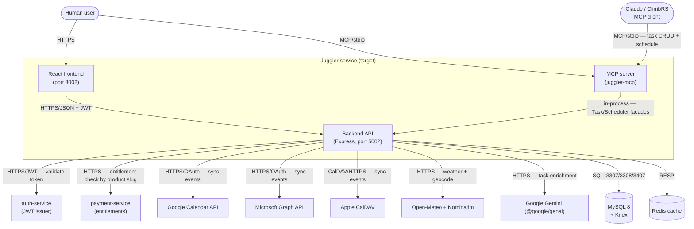
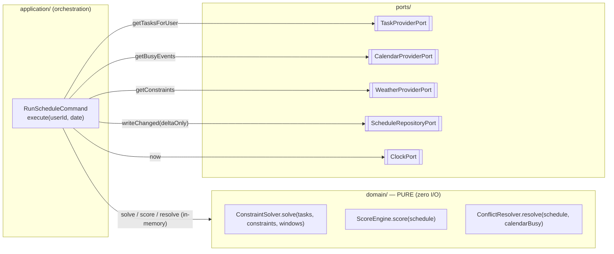
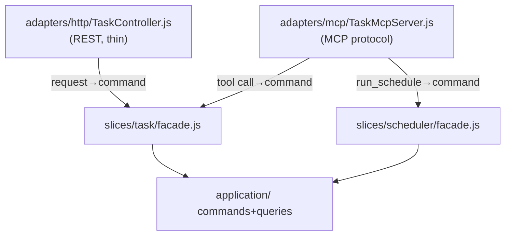
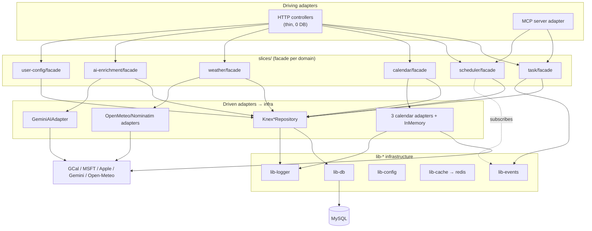

# Juggler Backend — Hexagonal Architecture DESIGN (Target State)

**Status:** active · **Type:** architecture-overview (target/design) · **Last updated:** 2026-06-09

> ## SUPERSEDES `JUGGLER-HEX-REVIEW.md` (2026-01-14)
>
> This document **supersedes** the January-2026 `JUGGLER-HEX-REVIEW.md`. That doc is retained
> only as historical record and **must not be cited for current-state numbers** — several of its
> figures are confirmed wrong (it reported `app.js` = 11,763 ln / `server.js` = 6,103 ln; the
> verified values are 305 / 183 — see `JUGGLER-ARCH-REVIEW-2026-06.md §5`).
>
> **Why superseded:** (1) the Jan-2026 doc mixed current-state review with a target plan in one
> file and is 5 months stale; (2) its proposed migration order ("Scheduler first") is **reversed**
> from the binding-invariant-driven order this design mandates (scheduler **LAST** — cascade risk
> per `CLAUDE.md`); (3) it predates the verified June-2026 current-state baseline. **The target
> topology in this design is built from `JUGGLER-ARCH-REVIEW-2026-06.md` (the W1 verified review),
> not from the stale Jan doc.** Reusable target topology (slice trees, port/adapter names) was
> mined from the Jan doc but re-grounded against the verified current state.

**Source of current-state truth:** [`JUGGLER-ARCH-REVIEW-2026-06.md`](./JUGGLER-ARCH-REVIEW-2026-06.md) (cookie, 2026-06-09).
**Binding invariants:** [`juggler/CLAUDE.md`](../../CLAUDE.md) §Scheduler, §Calendar Sync, §Approved Fallbacks.
**House style reference:** `resume-optimizer-backend/src/slices/<domain>/{domain/{entities,ports,value-objects},application/{commands,queries},adapters,facade.js}`.

---

## 1. Purpose & context (C4 L1)

Juggler is a task + calendar management service: it schedules a user's tasks against hard
deadlines, dependency chains, recurrence rules and external-calendar events, and bi-directionally
syncs the resulting plan to Google / Microsoft / Apple calendars. Its **core domain is the
scheduler** (5,370 ln, the largest and most fragile subsystem), not the controllers.

This design defines the **target hexagonal topology** the service migrates toward. The current
state is monolithic MVC (`routes → controllers → src/db.js` singleton, ~5% hex). The target
isolates each domain behind a `facade.js` over `ports`, with infrastructure injected as adapters,
so the scheduler's pure algorithm can be characterization-tested without a database.



**Legend / external dependencies:** auth-service issues the JWT whose `plans` claim is keyed by
product **slug** (`'juggler'`); payment-service answers entitlement checks; the three calendar
providers are the only stateful external integrations; Open-Meteo/Nominatim and Gemini are
read-mostly external calls (both currently lack timeouts — `ARCH-REVIEW §6 #6`, addressed by the
`WeatherProviderPort`/`AIPort` adapters in this design).

---

## 2. Target hexagonal topology — all six domains

Each domain becomes a **vertical slice** under `juggler-backend/src/slices/<domain>/` with the
canonical RO house-style tree. External code may import **only** `<slice>/facade.js`
(enforced — §7). Concrete port/adapter names are fixed below so the migration legs share a
vocabulary.

### 2.1 Slice tree (canonical shape, applied per domain)

```
slices/<domain>/
├── domain/                      # PURE — zero require('knex'|'express'|SDK)
│   ├── entities/                # identity + invariants (Task, Schedule, CalendarEvent…)
│   ├── ports/                   # interface contracts (JSDoc typedefs) — *Port.js
│   └── value-objects/           # TaskStatus, TimeWindow, Deadline, ProviderType…
├── application/
│   ├── commands/                # write use-cases (CreateTask, RunSchedule, SyncCalendar)
│   └── queries/                 # read use-cases (GetTask, GetSchedule, GetSyncStatus)
├── adapters/                    # infra implementations of ports (Knex*, InMemory*, Mock*, provider SDKs)
├── facade.js                    # the ONLY public entry point — wires adapters → ports → app layer
└── index.js                     # module exports (re-exports facade)
```

### 2.2 Per-domain ports & adapters

| Domain (slice) | Entities / VOs | Ports (interfaces) | Adapters (implementations) |
|----------------|----------------|--------------------|----------------------------|
| **scheduler** (core) | `Schedule` (aggregate root), `ScheduledTask`, `Constraint`, `ScoredSchedule`; VOs `TimeWindow`, `Priority`, `Deadline` | `TaskProviderPort` (inject task data), `CalendarProviderPort` (inject busy/event data), `ScheduleRepositoryPort` (persist delta), `WeatherProviderPort` (constraint input), `ClockPort` (DB-clock `now`) | `SchedulerTaskProvider` (over Task facade), `SchedulerCalendarProvider` (over Calendar facade), `KnexScheduleRepository`, `InMemoryScheduleRepository`, `MysqlClockAdapter` |
| **task** | `Task`, `TaskInstance`, `RecurrenceRule`, `TimeBlock`; VOs `TaskId`, `TaskStatus`, `PlacementMode` | `TaskRepositoryPort`, `TaskCachePort`, `TaskEventPort` | `KnexTaskRepository`, `InMemoryTaskRepository`, `RedisTaskCache`, `EventBusTaskEvents` (over lib-events) |
| **calendar** | `CalendarEvent`, `SyncState`; VOs `EventId`, `ProviderType` | `CalendarPort` (provider interface — already specified in `slices/calendar/README.md`), `SyncStateRepositoryPort` | `GoogleCalendarAdapter`, `MicrosoftCalendarAdapter`, `AppleCalendarAdapter`, `InMemoryCalendarAdapter` (the **3 real + 1 test** adapters); `KnexSyncStateRepository` |
| **weather** | `WeatherConstraint`; VO `GeoPoint` | `WeatherProviderPort`, `GeocodePort`, `WeatherCacheRepositoryPort` | `OpenMeteoWeatherAdapter`, `NominatimGeocodeAdapter`, `MockWeatherProvider`, `KnexWeatherCacheRepository` |
| **ai-enrichment** | `Enrichment` (global, shared), `UserOverride` (per-user) | `AIPort` (a.k.a. `LLMPort`), `EnrichmentRepositoryPort`, `AIUsagePort` | `GeminiAIAdapter` (wraps `@google/genai` — **removes the controller/route SDK leak**), `MockAIAdapter`, `KnexEnrichmentRepository`, `RedisAIUsageQueue` |
| **user-config** | `UserConfig`, `Entitlement` | `ConfigRepositoryPort`, `EntitlementPort` (over payment-service) | `KnexConfigRepository`, `InMemoryConfigRepository`, `PaymentServiceEntitlementAdapter` |

**External-facing adapters (driving side, all six share):** the HTTP controller adapter
(`adapters/http/*Controller.js`, thin — translates request→command, 0 DB) and, for **task** and
**scheduler**, the **MCP adapter** (§5). Both call the same facade.

---

## 3. Pure-domain core for the scheduler

The scheduler core is **pure functions over injected data** — no Knex, no Express, no external
SDK, no clock read of its own. This is the single most important structural target because, per
`CLAUDE.md`, *scheduler bugs cascade and corrupt all task data*.



- **`ConstraintSolver.solve(tasks, constraints, timeWindows)`** — orders **most-constrained →
  least-constrained**, applies severity **Deadlines > dependencies > preferences**, places
  recurring instances on the **same day** the recurrence fires. Pure: same inputs → same output.
- **`ScoreEngine.score(schedule)`** — pure scoring (extracted from `scoreSchedule.js`), no DB.
- **`ConflictResolver.resolve(schedule, calendarBusy)`** — pure conflict reconciliation against
  injected calendar-busy windows.
- **`RunScheduleCommand`** — the only layer that touches I/O: pulls data through ports, calls the
  pure core in-memory, and writes **only changed tasks** (delta) back through
  `ScheduleRepositoryPort`. It **does not call itself** and emits no cascading schedule events.

**Extraction gate:** the scheduler slice may not be merged without **characterization tests**
(golden-master over real fixtures) proving the pure core reproduces current behavior bit-for-bit
before any refactor. Migrate this slice **LAST**.

---

## 4. Infrastructure-lib layer (target) and how slices consume it

`src/lib/` holds cross-cutting infrastructure. Slices consume these **inside adapters only** —
never from `domain/`. Current adoption is partial (`ARCH-REVIEW §3`); the target finishes it.

| Lib | Provides | Target consumption | Current → target |
|-----|----------|--------------------|------------------|
| **lib-db** (`lib/db`) | `createKnex()`, `withTransaction()` | every `Knex*Repository` adapter obtains its connection here; **`src/db.js` singleton retired** | 1 consumer → all repo adapters (retire the 35-importer singleton) |
| **lib-logger** (`lib/logger`) | `createLogger()` | adapters + application layer log through it; domain stays log-free | 7 importers → all slices |
| **lib-config** | typed env access | adapters read config here, never `process.env` directly in domain | **absent → create** |
| **lib-cache** | `CachePort` over `lib/redis.js` | `RedisTaskCache`, `RedisAIUsageQueue` wrap this | redis client (8 importers, no port) → port wrapper |
| **lib-events** | event bus | `TaskEventPort` adapter publishes here; scheduler **subscribes** to task-mutation events to trigger (never self-trigger) | **0 importers (DEAD) → adopt-or-delete (ADR-0001)** |

**Persistence rule (binding):** every `Knex*Repository` adapter writes `created_at` / `updated_at`
with **`new Date()`**, never `db.fn.now()` (circular-JSON serialization veto, 2026-05-12 — §6,
ADR-0003).

---

## 5. MCP server as an external-facing adapter

The MCP server (`juggler-mcp/`, exposed to ClimbRS/Claude) is a **driving adapter** over the
**Task** and **Scheduler** facades — peer to the HTTP controller adapter, sharing the same
application layer. No business logic lives in MCP tool handlers.



**Invariant carried here:** the scheduler is *triggered by user/MCP mutation only*. The MCP
`create_task` / `update_task` / `run_schedule` tools enter through the same Task/Scheduler
facade as HTTP, so the "mutation → schedule" trigger path is identical for both driving adapters
and the scheduler still **never self-triggers**.

---

## 6. Invariants Preserved

Every binding invariant from `CLAUDE.md` / the task brief maps to the port, adapter, or test that
guarantees it survives the migration. A design that violates any row is rejected.

| # | Invariant (source) | Where it lives in the target | Guaranteed by |
|---|--------------------|------------------------------|---------------|
| S1 | Schedule **most-constrained → least-constrained** | `ConstraintSolver.solve()` ordering | Pure-core; **characterization test** asserts ordering |
| S2 | Severity **Deadlines > dependencies > preferences** | `ConstraintSolver` severity comparator; `Priority`/`Deadline` VOs | Characterization test on mixed-severity fixture |
| S3 | Recurring instances scheduled **same-day** as recurrence fires | `ConstraintSolver` + `RecurrenceRule` entity (placement) | Characterization test on recurring fixture |
| S4 | Scheduler triggered by **user/MCP mutation only — never self-triggers** | trigger enters via Task/Scheduler **facade** (HTTP + MCP adapters); core has no trigger path | §5 topology; test asserts core emits no schedule event |
| S5 | **Delta-writes only** (write changed tasks, not full rebuild) | `ScheduleRepositoryPort.writeChanged(delta)` — only mutating method | Port contract; test counts writes = changed-only |
| S6 | **No cascading scheduler calls** from within scheduler | `RunScheduleCommand` is the sole orchestrator; core pure, cannot re-enter | Test: solve() makes no port writes; no recursion |
| S7 | Task-type terms exact (`one-off`, `chain member`, `recurring instance`, `split chunk`) | `TaskStatus`/`PlacementMode` value-objects (closed enums) | VO rejects unknown terms; lint on string literals |
| S8 | Scheduler extraction needs **characterization tests** | gate on the scheduler slice merge | Merge blocked until golden-master passes (§3) |
| P1 | Repository uses **`new Date()` not `db.fn.now()`** for created_at/updated_at | every `Knex*Repository` adapter | ADR-0003; adapter unit test asserts JS Date passed |
| C1 | Apple **repush-loop fix** (`miss_count >= 1` guard) | `AppleCalendarAdapter` (carried from `lib/cal-adapters/apple`) | Adapter test preserves the guard; soak doc cross-link |
| C2 | MSFT/Apple event bodies include **`task.url` as "Link:"** | `MicrosoftCalendarAdapter` / `AppleCalendarAdapter` `buildEventBody` | Adapter test asserts "Link:" line present |
| C3 | Known open issues: sync **DB-contention on simultaneous syncs** + **split-task-part sync** | `SyncStateRepositoryPort` (sync-lock) + `ConflictResolver` split handling | Documented in §11; carried, not regressed |

**Coverage:** all listed scheduler invariants (S1–S8), the persistence invariant (P1), and all
calendar invariants (C1–C3) are mapped — **complete**.

---

## 7. Cross-slice rules (boundary enforcement)

1. **Facade-only imports.** External code imports `require('./slices/<domain>/facade')` only —
   never `adapters/`, `domain/ports/`, or `domain/entities/` of another slice.
2. **No DB in the domain layer.** `slices/*/domain/**` may not `require('knex')`, `src/db.js`,
   `lib/db`, any provider SDK, or `express`. Data enters via ports.
3. **ESLint boundary enforcement.** `eslint.boundaries.config.js` already forbids direct imports
   of `slices/calendar/{adapters,domain/ports,domain/entities}` (wired into `lint:boundaries` +
   `precommit`). The target **replicates these `no-restricted-syntax` rules per new slice** as each
   is created — so the guard asserts something real (today it guards an empty calendar slice —
   `ARCH-REVIEW §6 #5`). A `domain/`-imports-infra rule is added to block rule 2 violations.

---

## 8. Container view + key decisions (ADRs)

### 8.1 Target container view (C4 L2)



### 8.2 ADRs

> Full ADR files (per `BASE-ARCH-DOC-STANDARD §4`) live in `docs/architecture/adr/`; the summaries
> below index the decisions that shape this design. Each carries **Alternatives considered**.

**ADR-0001 — Resolve `lib-events`: adopt as the scheduler trigger bus (do not delete).**
*Status:* Proposed · *Date:* 2026-06-09 · *Deciders:* cookie, Kermit.
*Context:* `lib/events` is 634 ln, **0 importers** (dead scaffolding, `ARCH-REVIEW §6 #2`). The
scheduler must be triggered by task mutations without self-triggering (S4/S6).
*Decision:* Adopt `lib-events` as the **TaskEventPort** backing bus — Task slice publishes
mutation events; Scheduler slice subscribes and runs. This gives the mutation→schedule trigger a
typed seam.
*Consequences:* Easier: clean trigger boundary, no controller-to-scheduler direct call. Harder:
must wire 1 publisher + 1 subscriber before the scheduler slice lands; until then keep the direct
facade call. *Alternatives considered:* **(a) delete lib-events** and keep direct facade trigger —
rejected: loses the decoupled seam the scheduler needs and discards 634 ln of built work;
**(b) leave it dead** — rejected: drift risk, false signal.

**ADR-0002 — Finish `lib-db` migration; retire the `src/db.js` singleton.**
*Status:* Proposed · *Date:* 2026-06-09 · *Deciders:* cookie, Kermit.
*Context:* `lib-db` exists but has **1** consumer; `src/db.js` singleton still has **35** importers
(`ARCH-REVIEW §3`) — the worst half-state. *Decision:* Route every `Knex*Repository` adapter
through `lib-db`; migrate the 35 consumers slice-by-slice as each slice lands; delete `src/db.js`
when the last consumer moves. *Consequences:* Single DB-access home, testable repos. Harder: 35
edits spread across legs. *Alternatives considered:* **(a) keep `src/db.js` as canonical, delete
lib-db** — rejected: blocks per-slice repository injection; **(b) big-bang migrate all 35 at once**
— rejected: high blast radius, violates delta-migration discipline.

**ADR-0003 — Repository timestamps use `new Date()`, never `db.fn.now()`.**
*Status:* Accepted · *Date:* 2026-05-12 (recorded here 2026-06-09) · *Deciders:* prior veto.
*Context:* `db.fn.now()` returns a Knex raw object that breaks circular-JSON serialization on the
write path. *Decision:* All `Knex*Repository` adapters set `created_at`/`updated_at` with a JS
`new Date()`. *Consequences:* Serializable writes; timestamp comes from app server, not DB clock
(scheduler's `now` instead uses `ClockPort` → `MysqlClockAdapter` where DB-clock parity matters).
*Alternatives considered:* **(a) `db.fn.now()`** — rejected (the veto: circular-JSON break);
**(b) raw SQL `NOW()`** — rejected: same serialization class + couples domain to SQL dialect.

---

## 9. Non-goals / what stays as-is

- **No behavior change in this design.** This is a target topology, not a rewrite. Each slice is a
  behavior-preserving extraction verified by characterization tests.
- **Scheduler is migrated LAST**, not first (reverses the Jan-2026 recommendation) — cascade risk.
  Recommended order: **Weather → Calendar Port → Task → User/Config → Scheduler** (`ARCH-REVIEW §7`).
- **The 3 calendar adapters keep their current logic** (Apple `miss_count>=1` guard, MSFT/Apple
  `task.url` "Link:" bodies) — relocated under `slices/calendar/adapters/`, not rewritten.
- **Frontend (React, port 3002) is out of scope** — this design covers the backend service only.
- **No new external dependency** — same providers (auth, payment, GCal, MSFT, Apple, Open-Meteo,
  Gemini); the only addition is wrapping the ungoverned external calls behind ports with timeouts.
- **Approved fallbacks unchanged** — the four `TaskDetailHeader.jsx` fallbacks (`CLAUDE.md`
  §Approved Fallbacks) are frontend and out of scope.
- **DB schema & 146 migrations unchanged** — slices wrap the existing tables; no migration is part
  of this topology design.

---

## 10. Known limitations & evolution

- **Current state is ~5% hex** (`ARCH-REVIEW §7`). This design is the destination; legs land
  incrementally and each must keep CI green via the per-slice ESLint boundary rule.
- **Sync DB-contention on simultaneous syncs** and **split-task-part sync** remain **open issues**
  (`CLAUDE.md` §Calendar) — carried into `SyncStateRepositoryPort` / `ConflictResolver`, to be
  closed in the calendar slice leg, not regressed.
- **External-call resilience** (no timeout on Open-Meteo / Nominatim / Gemini — `ARCH-REVIEW §6 #6`)
  is closed by the `WeatherProviderPort` / `AIPort` adapters, which own timeout/AbortController.

---

## 11. References

- [`JUGGLER-ARCH-REVIEW-2026-06.md`](./JUGGLER-ARCH-REVIEW-2026-06.md) — verified current state (W1).
- [`JUGGLER-HEX-REVIEW.md`](./JUGGLER-HEX-REVIEW.md) — **superseded** Jan-2026 review (historical).
- [`JUGGLER-HEX-WBS.md`](./JUGGLER-HEX-WBS.md) — Jan-2026 WBS (target topology mined; sequencing reversed).
- [`README.md`](./README.md) — current C4 System Context + Container overview.
- [`../../CLAUDE.md`](../../CLAUDE.md) — binding invariants (§Scheduler, §Calendar Sync).
- `resume-optimizer-backend/src/slices/` — house-style hexagonal reference.
- `BASE-ARCH-DOC-STANDARD.md` — authoring standard this doc meets.

---

*Authored by abby (documentation-author muppet) with cookie's architectural input, 2026-06-09.
Supersedes `JUGGLER-HEX-REVIEW.md`.*
