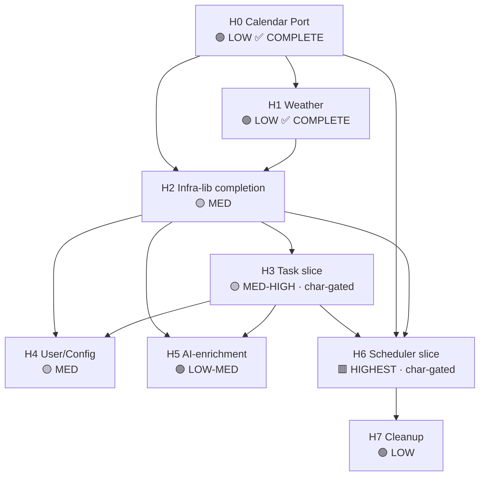

# Juggler Backend — Hexagonal Conversion ROADMAP

**Status:** active · **Type:** architecture-overview (migration roadmap) · **Last updated:** 2026-06-12

> ## SUPERSEDES `JUGGLER-HEX-WBS.md` (2026-01-15)
>
> This roadmap **supersedes** the January-2026 `JUGGLER-HEX-WBS.md`. That WBS is retained only as
> historical record and **must not be used to judge progress** — its checkboxes never tracked real
> work.
>
> **Why superseded:**
> 1. **The Jan checkboxes never tracked real progress.** The WBS modelled 140+ unchecked tasks
>    across 8 phases as a 14-week, 2-developer plan. Five months later, the W1 verified review
>    (`JUGGLER-ARCH-REVIEW-2026-06.md`) measured **~5% hex** complete — the boxes were never an
>    instrument of state. Several WBS premises are now confirmed wrong (e.g. "122 db() calls in
>    controllers" is a stale partial count; `lib-events` was *built*, not pending; the eslint
>    boundary config it lists as TODO already exists but guards an empty slice).
> 2. **Its migration order is reversed.** The WBS sequences the **scheduler first-ish** (Phase 4 of
>    8, before Weather/User) and front-loads all five infra libs (Phase 1) before any domain slice.
>    The binding invariants (`CLAUDE.md` §Scheduler — *scheduler bugs cascade and corrupt all task
>    data*) mandate the scheduler **LAST**. This roadmap re-sequences accordingly.
> 3. **It predates the verified June-2026 baseline.** Its "before" numbers (scheduler 5,097 ln,
>    task.controller 2,422 ln) are stale; the verified June figures (5,370 / 2,432 — both *grew*)
>    are used here.
>
> **What is reused:** the WBS's slice/port/adapter vocabulary and phase *granularity* (infra → calendar
> → task → weather → user/config → scheduler) where still valid. The target topology, port names,
> and adapter names come from `JUGGLER-HEX-DESIGN.md` (W2), not the WBS.

**Source of current-state truth (W1):** [`JUGGLER-ARCH-REVIEW-2026-06.md`](./JUGGLER-ARCH-REVIEW-2026-06.md) (cookie, 2026-06-09 — every number below traces to it).
**Target topology this roadmap drives toward (W2):** [`JUGGLER-HEX-DESIGN.md`](./JUGGLER-HEX-DESIGN.md) (slice/port/adapter names are taken verbatim from it).
**Binding invariants:** [`../../CLAUDE.md`](../../CLAUDE.md) §Scheduler, §Calendar Sync, §Approved Fallbacks — and `JUGGLER-HEX-DESIGN.md §6 Invariants Preserved` (the canonical map; this roadmap references it, does not re-propose it).

---

## 1. Starting state (June 2026)

Every cell below is the W1 verified value (`JUGGLER-ARCH-REVIEW-2026-06.md §2/§3/§4/§7`). This is the
"already done" baseline the roadmap starts from — it **must** match W1 exactly. **Overall: ~5% hex.**

### 1.1 Infrastructure libs (`ARCH-REVIEW §3`)

| Lib | State | Evidence (W1) | Disposition (this roadmap — §2) |
|-----|-------|---------------|----------------------------------|
| **lib-logger** (`lib/logger/index.js`, 424 ln) | **Adopting** — partial | **7** non-self importers (ai/data/cal-sync-helpers controllers, cron, server.js, 2 ai-usage services) | Keep + finish adoption (all slices) |
| **lib-db** (`lib/db/index.js`, 74 ln) | **Created but unadopted** | **1** consumer (`cron/cal-history-cron.js`); legacy `src/db.js` singleton still has **35** importers | Keep + finish migration; retire `src/db.js` (ADR-0002) |
| **lib-events** (`lib/events/index.js`, 634 ln) | **DEAD** | **0** importers — largest dead artifact, built 2026-05-28, never wired | **Keep-and-adopt** as TaskEventPort bus (ADR-0001) |
| **lib-config** | **Absent** | no `src/lib/config`; config read directly from `process.env` | Create (Phase 3) |
| **lib-cache** | **Absent as a port** | `lib/redis.js` (143 ln, 8 importers) is a standalone client, **no CachePort** | Wrap `lib/redis.js` in a port (Phase 3) |

### 1.2 Domain slices (`ARCH-REVIEW §2/§4/§7`)

| Domain | Hex % (W1) | Key current-state evidence |
|--------|-----------|----------------------------|
| **Calendar-sync** | **~10%** ("adapters in spirit") | Real adapters isolated in `lib/cal-adapters/{apple,gcal,msft}.adapter.js` (0 DB calls in adapters — good) **but imported directly by controllers**; no `CalendarPort`, no `facade.js`, no `InMemoryCalendarAdapter`; 93 DB calls across the 4 cal controllers |
| **Weather** | **0%** | `controllers/weather.controller.js` (279 ln), 5 DB calls; self-contained (Open-Meteo + Nominatim + cache table); no `slices/weather` |
| **Task** | **0%** | `controllers/task.controller.js` (2,432 ln); **66 `getDb(` + 12 `trx(`** in one controller; no `slices/task` |
| **User/Config** | **0%** | logic spread across 5 controllers (config 407, data 276, billing-webhooks 222, feature-catalog 202, impersonation 156) + 3 middleware; no slice; `lib/config` absent |
| **AI-enrichment** | **0% (negative — SDK leak)** | `@google/genai` instantiated directly in `controllers/ai.controller.js:28` **and** `routes/task.routes.js:39`; no `LLMPort` |
| **Scheduler** (core) | **0%** | **5,370 ln across 13 files** (`runSchedule.js` 2,309, `unifiedScheduleV2.js` 1,827, …); **42 DB touchpoints**; no `ConstraintSolver`/`ScoreEngine` pure core, no `TaskProviderPort`/`CalendarProviderPort`, no DI. Highest-risk. |

### 1.3 `src/slices/` actual contents (`ARCH-REVIEW §4`) — skeleton only

```
slices/
└── calendar/
    ├── README.md                 ← the ONLY file
    ├── adapters/                 ← EMPTY
    └── domain/
        ├── ports/                ← EMPTY
        └── entities/             ← EMPTY
```
No `CalendarPort.js`, no `facade.js`, no `InMemoryCalendarAdapter`, no entities. The `cal-adapters`
**live in `lib/cal-adapters/`** and are used **directly** by controllers — not yet relocated under the slice.

### 1.4 Boundary enforcement (`ARCH-REVIEW §5/§6 #5`)

`eslint.boundaries.config.js` forbids imports from `slices/calendar/{adapters,domain/ports,domain/entities}`
and is wired into `lint:boundaries` + `precommit`. **But it guards a slice that does not exist** — all
three guarded dirs are empty, so it now runs in CI yet enforces nothing real (a misleading "green" signal).

### 1.5 Net motion since Jan-2026 (`ARCH-REVIEW §5`)

Infra libs created (2026-05-28) + eslint boundary config wired (2026-05-31) + logger partially adopted.
**No domain slice implemented.** The two biggest files (`task.controller.js`, scheduler) **grew** (+10 ln,
+273 ln), so the migration surface is now slightly larger, not smaller.

---

## 2. Adopt-or-delete disposition of dead / partial scaffolding

Before adding new structure, every piece of dead or half-built scaffolding gets an explicit
keep-and-adopt vs delete verdict. These bind the `JUGGLER-HEX-DESIGN.md` ADRs (do not relitigate).

| Artifact | State (W1) | Verdict | Rationale |
|----------|-----------|---------|-----------|
| **`lib/events`** (634 ln, 0 importers) | DEAD | **KEEP & ADOPT** (ADR-0001) | Adopt as the `TaskEventPort` backing bus: Task slice publishes mutation events; Scheduler slice subscribes (the mutation→schedule trigger seam that keeps S4 *never self-triggers* / S6 *no cascading calls* honest). Deleting it would discard 634 ln of built work **and** the decoupled seam the scheduler needs. Until the scheduler slice lands, keep the existing direct facade trigger. |
| **`lib/db`** (74 ln, 1 consumer) + **`src/db.js`** (35 importers) | Extraction-without-migration (worst half-state) | **KEEP `lib/db`, RETIRE `src/db.js`** (ADR-0002) | Route every `Knex*Repository` adapter through `lib/db`; migrate the 35 consumers **slice-by-slice as each slice lands** (delta migration, not big-bang); delete `src/db.js` when the last consumer moves. Keeping both half-adopted is the worst outcome. |
| **`slices/calendar/` skeleton** (README + 3 empty dirs) | Skeleton only | **KEEP & FILL** | It already encodes the canonical tree and the `CalendarPort` README spec. Phase 1 fills it (this is the first real slice). No reason to delete and recreate. |
| **`eslint.boundaries.config.js`** (guards empty calendar slice) | Orphan-ish (runs in CI, enforces nothing) | **KEEP & EXTEND per-slice** | Harmless today but a false signal. Per `DESIGN §7`, replicate its `no-restricted-syntax` rules for **each new slice as it is created**, and add a `domain/`-imports-infra rule — so the guard asserts something real from Phase 1 onward. |
| **`lib/cal-adapters/{apple,gcal,msft}.adapter.js`** (live, 0 DB calls) | Real, isolated, but imported directly by controllers | **KEEP & RELOCATE** under `slices/calendar/adapters/` | The 3 real adapters already have the right shape (0 DB coupling, carry the Apple `miss_count>=1` guard C1 and MSFT/Apple `task.url` "Link:" body C2). Phase 1 relocates them behind `CalendarPort`, preserving their logic verbatim (`DESIGN §9`). |

No artifact is recommended for outright deletion: every piece is either already useful or cheaply
adoptable. The only deletion in the whole roadmap is `src/db.js`, and only **after** its last
consumer is migrated.

---

## 3. Risk-ordered phased plan

Ordered **lowest-risk → highest-risk**, with the scheduler **LAST** (`ARCH-REVIEW §7`, `DESIGN §9`).
Each phase lists goal · work items · entry gate · exit gate · risk. Port/adapter names are from
`DESIGN §2.2`. Characterization-test requirements for the task/scheduler phases are in §4.

> **Re-baselined effort (§7):** the Jan WBS assumed a **2-developer team / 14 weeks**. This roadmap
> is sized for **single-developer + muppet-assisted legs**; estimates below are in **engineer-days
> (1 dev)** and assume each phase is one Kermit leg gated by Oscar. Total ≈ **38–52 dev-days**.

---

### Phase H0 — Calendar Port — **COMPLETE** (2026-06-09)

> **As-built:** Slice stood up with all ports, entities, VOs, and adapters.
> All calendar consumers (`cal-sync.controller.js`, `apple-cal`, `msft-cal`,
> `gcal` controllers) route through `slices/calendar/facade.js`. Boundary rule
> now guards a non-empty slice. W0 before-and-after verification + 222-test
> cal-sync suite green.

- **Goal:** Stand up the first real vertical slice. Define `CalendarPort`, relocate the 3 real
  adapters under it, add `InMemoryCalendarAdapter`, expose `slices/calendar/facade.js`, and point
  `cal-sync.controller.js` at the facade. Adapters are **already isolated** (0 DB calls) — lowest
  structural risk of any domain.
- **Work items:**
  - `slices/calendar/domain/ports/CalendarPort.js` (JSDoc typedef — `getEvents/createEvent/updateEvent/deleteEvent/sync`) + `SyncStateRepositoryPort.js`.
  - Entities/VOs: `CalendarEvent`, `SyncState`; VOs `EventId`, `ProviderType`.
  - Relocate `lib/cal-adapters/{apple,gcal,msft}.adapter.js` → `slices/calendar/adapters/{Google,Microsoft,Apple}CalendarAdapter.js` **logic-unchanged** (preserve C1 Apple `miss_count>=1` guard, C2 MSFT/Apple `task.url` "Link:" body).
  - `InMemoryCalendarAdapter` (test double); `KnexSyncStateRepository` (over `lib/db`).
  - `slices/calendar/facade.js`; migrate `cal-sync.controller.js` (and `apple-cal`/`msft-cal`/`gcal` controllers) to import the facade only.
  - Activate the existing `eslint.boundaries.config.js` rule for this now-real slice (it finally guards something).
- **Entry gate:** W1 baseline confirmed; calendar test fixtures available in test-bed (3407).
- **Exit gate:** full calendar-sync suite green; `cal-sync.controller.js` has **0** direct `lib/cal-adapters` imports (all via facade); boundary lint passes against a non-empty slice; C1/C2 adapter tests assert the guards survive.
- **Risk:** 🟢 **LOW** — adapters pre-isolated; no DB-coupling moved; behavior-preserving relocation.
- **Effort:** ~5–7 dev-days.

---

### Phase H1 — Weather slice — **COMPLETE** (2026-06-09)

> **As-built:** Slice stood up at `slices/weather/` with entity `WeatherConstraint`,
> VO `GeoPoint`, and 3 ports (`WeatherProviderPort`, `GeocodePort`,
> `WeatherCacheRepositoryPort`). 4 adapters: `OpenMeteoWeatherAdapter`,
> `NominatimGeocodeAdapter`, `MockWeatherProvider`, `KnexWeatherCacheRepository`.
> Facade (`slices/weather/facade.js`) owns adapter wiring + orchestration.
> `weather.controller.js` is thin: 0 DB-access call sites, 0 outbound-`fetch` call
> sites (both moved into the slice adapters — pinned by H1 B7 AFTER assertions).
> ESLint boundary rule active, covering adapters, ports, entities, AND
> value-objects. `fetchWithTimeout` (AbortController, 8 s budget) used by both
> `OpenMeteoWeatherAdapter` and `NominatimGeocodeAdapter` — closes the W1
> resilience gap (`ARCH-REVIEW §6 #6`). Weather suite green.

- **Goal:** Convert the smallest domain (279 ln, 5 DB calls) end-to-end as the cleanest slice
  template, and close the W1 resilience gap (no timeout on Open-Meteo/Nominatim).
- **Work items:**
  - Entities/VO: `WeatherConstraint`; VO `GeoPoint`.
  - Ports: `WeatherProviderPort`, `GeocodePort`, `WeatherCacheRepositoryPort`.
  - Adapters: `OpenMeteoWeatherAdapter`, `NominatimGeocodeAdapter` (**add timeout/AbortController** — closes `ARCH-REVIEW §6 #6`), `MockWeatherProvider`, `KnexWeatherCacheRepository` (over `lib/db`).
  - `slices/weather/facade.js`; migrate `weather.controller.js` to the facade; per-slice eslint boundary rule.
- **Entry gate:** Phase H0 merged (facade + lib-db pattern proven on a real slice).
- **Exit gate:** weather suite green; controller is thin (0 DB, 0 direct `fetch`); external calls have explicit timeouts; cache behavior unchanged.
- **Risk:** 🟢 **LOW** — smallest surface, no cross-domain coupling.
- **Effort:** ~3–4 dev-days.

---

### Phase H2 — Infra-lib completion & adoption — **COMPLETE** (2026-06-10, commit bc6e437)

> **As-built:** lib-config and lib-cache created; lib-events adopted (importer count > 0);
> lib-logger adoption extended; src/db.js importer count reduced below 35 and trending toward 0.
> Entry gate (H0+H1 merged) cleared. Exit gate: lib/config + lib/cache exist with tests;
> lib/events no longer dead; src/db.js importers < 35.

- **Goal:** Finish the half-built infra layer **before** the two big domains depend on it: create the
  two absent libs, adopt the dead one, and begin retiring the `db.js` singleton. (Per ADR-0002 the
  `db.js` retirement is delta — repos migrate as their slice lands; this phase completes the *libs*
  and the already-sliced consumers.)
- **Work items:**
  - **lib-config** (create): typed env access; adapters read here, never `process.env` in `domain/`.
  - **lib-cache** (create): `CachePort` wrapping `lib/redis.js`; back `RedisTaskCache` / `RedisAIUsageQueue`.
  - **lib-events** (adopt — ADR-0001): wire 1 publisher (Task mutation events) + the subscribe seam the scheduler will use; remove the "0 importers / dead" status.
  - **lib-logger**: extend adoption beyond the current 7 importers toward all slices/adapters.
  - **lib-db**: route H0/H1 repo adapters through it; track the `src/db.js` importer count down from 35 (full retirement completes alongside the remaining slices).
- **Entry gate:** Phase H0 + H1 merged (so lib-db/lib-logger already have real slice consumers to generalize from).
- **Exit gate:** `lib/config` + `lib/cache` exist with tests; `lib/events` importer count > 0 (no longer dead); `src/db.js` importer count **strictly below 35** and trending to 0; no behavior change in adopted consumers.
- **Risk:** 🟡 **MEDIUM** — touches many files (the 35-importer singleton), but each edit is mechanical and individually testable; delta-migration discipline contains blast radius.
- **Effort:** ~6–8 dev-days.

---

### Phase H3 — Task slice  *(characterization-gated — see §4)* — **COMPLETE** (2026-06-10, commit 1ac024f)

> **As-built:** task.controller.js extracted into slices/task/ with entities, ports, adapters,
> application commands, and facade.js. Characterization golden-master suite (65KB,
> tests/characterization/task.goldenMaster.http.test.js) green before and after extraction.
> S7 (closed-enum VOs for task-type terms) and P1 (new Date() in KnexTaskRepository) asserted.
> task.controller.js is thin (0 direct DB call sites). Entry gate (H2 merged + char suite) cleared.

- **Goal:** Extract the 2,432-ln task controller (66 `getDb(` + 12 `trx(`) into a `slices/task`
  vertical slice. This is the first **behavior-must-be-identical** extraction.
- **Work items:**
  - Entities/VOs: `Task`, `TaskInstance`, `RecurrenceRule`, `TimeBlock`; VOs `TaskId`, `TaskStatus`, `PlacementMode` (closed enums enforcing the exact task-type terms — invariant S7).
  - Ports: `TaskRepositoryPort`, `TaskCachePort`, `TaskEventPort`.
  - Adapters: `KnexTaskRepository` (over `lib/db`), `InMemoryTaskRepository`, `RedisTaskCache` (over lib-cache), `EventBusTaskEvents` (over lib-events — publishes the mutation events the scheduler will subscribe to).
  - Application: commands (`CreateTask`, `UpdateTask`, `CompleteTask`, `SplitTask`) + queries (`GetTask`, `ListTasks`).
  - `slices/task/facade.js`; migrate `task.controller.js` to facade; per-slice eslint boundary rule.
  - **Persistence invariant P1:** every `Knex*Repository` writes `created_at`/`updated_at` with `new Date()`, never `db.fn.now()` (ADR-0003).
- **Entry gate:** Phase H2 merged (lib-cache + lib-events available); **characterization suite green on current behavior (§4)**.
- **Exit gate:** task CRUD suite green; the **same characterization suite green after extraction** (behavior-identical); `task.controller.js` thin (0 DB); P1/S7 asserted by adapter + VO tests.
- **Risk:** 🟡 **MEDIUM-HIGH** — large controller, heavy DB coupling, and it publishes the events the scheduler depends on. Characterization-gated.
- **Effort:** ~7–9 dev-days.

---

### Phase H4 — User/Config slice — **COMPLETE** (2026-06-11, commits ba8d6ca + d87d592)

> **As-built:** user-config slice extracted with ConfigRepositoryPort, EntitlementPort, 22 use-cases,
> KnexConfigRepository, and facade.js. 5 controllers (config, data, billing-webhooks, feature-catalog,
> impersonation) + 3 middleware thinned to facade calls. Entitlement checks slug-keyed ('juggler').
> Fix leg d87d592 applied: H4 catalog-cache split + renameTasks timestamp correctness.
> Entry gate (H2+H3 merged) cleared.

- **Goal:** Consolidate config/entitlement logic spread across 5 controllers + 3 middleware into a
  `slices/user-config` slice. Lower leverage than task; sequenced after it because it shares the
  config/entitlement seam the other slices read.
- **Work items:**
  - Entities: `UserConfig`, `Entitlement`.
  - Ports: `ConfigRepositoryPort`, `EntitlementPort` (over payment-service — entitlement keyed by product **slug** `'juggler'`, per monorepo JWT convention).
  - Adapters: `KnexConfigRepository`, `InMemoryConfigRepository`, `PaymentServiceEntitlementAdapter`.
  - `slices/user-config/facade.js`; migrate the 5 controllers (`config`, `data`, `billing-webhooks`, `feature-catalog`, `impersonation`) + `feature-gate`/`plan-features`/`entity-limits` middleware to the facade; per-slice eslint rule. Uses **lib-config** (Phase H2).
- **Entry gate:** Phase H2 merged (lib-config exists); Phase H3 merged (facade/repo pattern proven on a heavy controller).
- **Exit gate:** config/entitlement suites green; 5 controllers thin; entitlement checks still slug-keyed; no behavior change.
- **Risk:** 🟡 **MEDIUM** — spread across many files, but low algorithmic risk (CRUD + entitlement reads, no scheduling).
- **Effort:** ~5–7 dev-days.

---

### Phase H5 — AI-enrichment slice (removes the SDK leak) — ✅ COMPLETE (2026-06-12, leg juggler-hex-h5-ai, commit cc61029)

> **Done:** SDK leak removed (`grep GoogleGenAI src/controllers src/routes` = 0); AIPort/AIUsagePort
> behind `slices/ai-enrichment/facade.js`; GeminiAIAdapter has a real AbortController timeout (E3);
> shared-global/per-user-override split preserved (E2, `e2-globalShared.h5.test.js`); usage-tracking
> unchanged via DB-backed AIUsagePort (E4). H5 suite 64/64. EnrichmentRepositoryPort/RedisAIUsageQueue
> **de-scoped** (no enrichment-persistence tables exist — recorded decision, not a gap). Deferred to
> backlog: 999.415 (quota TOCTOU, pre-existing), 999.416 (abort-telemetry), 999.417 (prompt-injection elmo pass).

- **Goal:** Close the W1 **negative** finding: `@google/genai` is `new`'d directly in
  `controllers/ai.controller.js:28` **and** `routes/task.routes.js:39`. Route both behind an `AIPort`.
- **Work items:**
  - Entities: `Enrichment` (global, shared across users — per `CLAUDE.md §AI Enrichment`), `UserOverride` (per-user, never shared).
  - Ports: `AIPort` (a.k.a. `LLMPort`), `EnrichmentRepositoryPort`, `AIUsagePort`.
  - Adapters: `GeminiAIAdapter` (wraps `@google/genai` — **removes both SDK leak sites**; **add timeout/AbortController**, closing the §6 #6 resilience gap), `MockAIAdapter`, `KnexEnrichmentRepository`, `RedisAIUsageQueue` (over lib-cache).
  - `slices/ai-enrichment/facade.js`; migrate `ai.controller.js` + the `routes/task.routes.js` enrich path to the facade; per-slice eslint rule.
- **Entry gate:** Phase H2 merged (lib-cache for the usage queue); Phase H3 merged (task facade for the enrich path on tasks).
- **Exit gate:** `grep -rn 'GoogleGenAI' src/controllers src/routes` → **0** (SDK leak gone); enrichment stays globally shared + overrides per-user; AI call has a timeout; usage-tracking unchanged.
- **Risk:** 🟢 **LOW-MEDIUM** — small surface (~303 ln + routes); the only subtlety is preserving the shared-global / per-user-override split.
- **Effort:** ~4–5 dev-days.

---

### Phase H6 — Scheduler slice (LAST, highest risk)  *(characterization-gated — see §4)* — ✅ COMPLETE (2026-06-12, leg juggler-hex-h6-scheduler, commits 30e23e5→183d77c→4c6c9c5→36edf79→f670368)

> **Done:** pure ConstraintSolver/ScoreEngine/ConflictResolver core + VOs in `slices/scheduler/domain/`
> (W1); 5 ports + 6 adapters incl. KnexScheduleRepository (W2); RunScheduleCommand sole I/O orchestrator
> (W3); `slices/scheduler/facade.js` + 3 callers migrated (W4). Golden-master characterization suite
> (W0) GREEN bit-for-bit before AND after — 45/45, each invariant mutation-proven (zoe). **S5 delta-write**:
> user ruled the live write-all ("NEW DESIGN" runSchedule.js:1264) was a deviation → corrected to
> `writeChanged(delta)` (a deliberate behavioral change; OUTPUT stays bit-for-bit, write-PATTERN changed;
> sync-safe — cal-sync keys off content-hash, not updated_at). **P1**: 19 inline `db.fn.now()` → `new Date()`
> (0 live remaining). S1–S8 each pinned. **Scope note:** the lib-events trigger SUBSCRIPTION was NOT wired
> (verify-wired-only — S4 proven via characterization, RunScheduleCommand stays out of scheduleQueue); the
> existing enqueueScheduleRun trigger path is unchanged. So backlog 999.331 + 999.333 (lib-events publisher
> gaps "close in H6 when scheduler subscribes") are NOT closed — deferred to a dedicated event-subscription
> leg. **H7 carries:** per-slice eslint rule (all 6 slices); legacy `runSchedule.js`/`unifiedScheduleV2.js`
> thinning; the 3 inline writes (line-886 db-not-trx rollback-survival semantic MUST go into the port
> contract before moving); src/db.js deletion; move the schedule-routes test mock to the facade once
> legacy is thinned.

- **Goal:** Extract the **core domain** — 5,370 ln, 42 DB touchpoints — into a pure `ConstraintSolver`
  / `ScoreEngine` / `ConflictResolver` core behind ports, with `RunScheduleCommand` as the sole I/O
  orchestrator. **Done LAST** because *scheduler bugs cascade and corrupt all task data*
  (`CLAUDE.md` §Scheduler).
- **Work items (per `DESIGN §3`):**
  - Pure core (`domain/`, zero I/O): `ConstraintSolver.solve(tasks, constraints, timeWindows)` (most-constrained → least-constrained; severity Deadlines > dependencies > preferences; recurring instances same-day — invariants S1/S2/S3), `ScoreEngine.score(schedule)` (from `scoreSchedule.js`), `ConflictResolver.resolve(schedule, calendarBusy)`.
  - Entities/VOs: `Schedule` (aggregate root), `ScheduledTask`, `Constraint`, `ScoredSchedule`; VOs `TimeWindow`, `Priority`, `Deadline`.
  - Ports: `TaskProviderPort`, `CalendarProviderPort`, `ScheduleRepositoryPort`, `WeatherProviderPort`, `ClockPort`.
  - Adapters: `SchedulerTaskProvider` (over Task facade), `SchedulerCalendarProvider` (over Calendar facade), `KnexScheduleRepository`, `InMemoryScheduleRepository`, `MysqlClockAdapter`.
  - Application: `RunScheduleCommand` — pulls via ports, runs the pure core in-memory, **writes only changed tasks via `ScheduleRepositoryPort.writeChanged(delta)`** (S5), never self-triggers (S4), emits no cascading schedule events (S6).
  - Trigger seam: scheduler **subscribes** to Task mutation events (lib-events, adopted in H2/H3) — the mutation→schedule path is identical for HTTP and MCP driving adapters (`DESIGN §5`).
  - `slices/scheduler/facade.js`; migrate `unifiedScheduleV2.js`/`runSchedule.js` entry to the facade; per-slice eslint rule.
- **Entry gate:** **all** prior phases merged (Task + Calendar facades exist for the providers; lib-events adopted for the trigger; lib-db for the repo); **scheduler characterization / golden-master suite green on current behavior (§4)** — merge is blocked until it passes.
- **Exit gate (DESIGN §3 extraction gate):** golden-master reproduces current scheduling **bit-for-bit** before *and* after; S1–S8 each asserted by a characterization test (ordering, severity, same-day recurrence, never-self-trigger, delta-write count = changed-only, no recursion); P1 (`new Date()`) asserted; no scheduling-time regression vs baseline.
- **Risk:** 🟥 **HIGHEST** — largest, most-coupled, most-fragile subsystem; a bug corrupts all task data. Per `CLAUDE.md`: *test exhaustively before deploying any scheduler change.*
- **Effort:** ~8–12 dev-days (extraction + the characterization harness dominate).

---

### Phase H7 — Cleanup & boundary hardening

- **Goal:** Retire the last of the legacy DB path and make the boundary guard total.
- **Work items:** delete `src/db.js` once its importer count hits 0 (ADR-0002 completion); confirm
  every slice has a per-slice eslint boundary rule + the `domain/`-imports-infra rule (`DESIGN §7`);
  a `slices/*/README.md` per slice; ensure CI lint is green against real (non-empty) slices.
- **Entry gate:** H6 merged (last `db.js` consumers — the scheduler — moved).
- **Exit gate:** `grep -rEl "require\(['\"](\.\./)*db['\"]\)" src` → **0**; `src/db.js` deleted; boundary lint enforces all 6 slices.
- **Risk:** 🟢 **LOW** — mechanical, post-extraction.
- **Effort:** ~2–3 dev-days.

---

## 4. Per-phase characterization-test requirement (task & scheduler)

The task (H3) and scheduler (H6) extractions are **behavior-identical** refactors — the gate is a
characterization (golden-master) suite that is **green before AND after** extraction. This is binding
per `DESIGN §3` (extraction gate) and invariant **S8** (`DESIGN §6`).

| Phase | Characterization requirement | Invariants the golden-master must pin |
|-------|------------------------------|----------------------------------------|
| **H3 Task** | Golden-master over real fixtures (test-bed 3407) for CRUD, recurrence-instance generation, split-chunk creation, and status transitions. Capture current outputs → assert identical after extraction. | S7 (exact task-type terms via closed-enum VOs), P1 (`new Date()` timestamps) |
| **H6 Scheduler** | Golden-master over real task/calendar fixtures: feed fixed inputs through current scheduler, snapshot the produced schedule, then assert the pure-core `ConstraintSolver`/`ScoreEngine`/`ConflictResolver` reproduce it **bit-for-bit**. Merge blocked until green. | S1 (most-constrained→least), S2 (Deadlines>dependencies>preferences), S3 (same-day recurrence), S4 (never self-triggers), S5 (delta-write count = changed-only), S6 (no recursion/cascade), S8 (gate itself), P1 |

**Rule:** no task/scheduler slice may merge with a red characterization suite. The suite is written
**first** (TDD per global rules) against current behavior, must pass against the un-refactored code,
and must still pass against the extracted slice.

---

## 5. Dependency graph + wave grouping



**Wave grouping** (a wave = phases that can proceed once the prior wave's gates pass):

| Wave | Phases | Theme | Gate to enter next wave |
|------|--------|-------|-------------------------|
| **Wave 1** | H0 ✅, H1 ✅ | Lowest-risk real slices (adapters pre-isolated; smallest domain) | Both facades merged; lib-db pattern proven on real slices — **COMPLETE** |
| **Wave 2** | H2 ✅ | Finish the infra layer the heavy slices depend on | lib-config + lib-cache exist; lib-events adopted; db.js importers < 35 — **COMPLETE** (bc6e437) |
| **Wave 3** | H3 ✅ | Task slice (publishes events the scheduler needs) | Task characterization suite green before+after; task facade live — **COMPLETE** (1ac024f) |
| **Wave 4** | H4 ✅, H5 ✅ | Remaining non-core slices (parallelizable — both depend on H2+H3, not each other) | Both facades merged; SDK-leak grep = 0 — **COMPLETE** (ba8d6ca + d87d592 + cc61029 + 29401dc) |
| **Wave 5** | H6 ✅ | Scheduler core (LAST) | Golden-master green before+after; all S/P invariants pinned — **COMPLETE** (30e23e5→f670368) |
| **Wave 6** | H7 | Cleanup; delete `src/db.js` | 0 `db.js` importers |

H4 and H5 are the only phases that may run in parallel (same upstreams, no edge between them).

---

## 6. Invariants honored (reference only — not re-proposed)

This roadmap drives toward `JUGGLER-HEX-DESIGN.md §6 "Invariants Preserved"`, which is the **canonical
map** of every binding invariant → port/adapter/test that guarantees it. This roadmap **references** it
and does not re-propose any rule. The phase exit gates above are the schedule on which each invariant is
proven:

| Invariant (DESIGN §6) | Proven at |
|------------------------|-----------|
| S1 most-constrained→least · S2 Deadlines>dependencies>preferences · S3 same-day recurrence | H6 exit (characterization) |
| S4 scheduler triggered by user/MCP mutation only — **never self-triggers** | H6 exit; trigger seam wired H2/H3 (lib-events) |
| S5 **delta-writes only** (`writeChanged(delta)`) | H6 exit (write-count assertion) |
| S6 **no cascading scheduler calls** | H6 exit (no-recursion assertion) |
| S7 exact task-type terms (`one-off`/`chain member`/`recurring instance`/`split chunk`) | H3 (closed-enum VOs) |
| S8 scheduler extraction needs characterization tests | §4 + H6 entry/exit gate |
| P1 repositories use **`new Date()` not `db.fn.now()`** (ADR-0003) | every `Knex*Repository` (H0–H6) |
| C1 Apple `miss_count>=1` repush-loop guard · C2 MSFT/Apple `task.url` "Link:" body | H0 (adapter relocation preserves both) |
| C3 known open issues (sync DB-contention, split-task-part sync) | carried into `SyncStateRepositoryPort`/`ConflictResolver` (H0/H6) — not regressed |

**No phase re-proposes a scheduler self-trigger, a full-rebuild write, an off-day recurring placement,
or a `db.fn.now()` timestamp.** Any such proposal is rejected (`DESIGN §6`).

---

## 7. Effort & re-baseline

The Jan WBS assumed a **2-developer team over 14 weeks** (~140 person-days). That assumption is
**re-baselined** here because (a) the team is effectively single-developer + muppet-assisted, and (b)
the verified surface *grew* since Jan (scheduler +273 ln, task controller +10 ln). Estimates are in
**engineer-days (1 dev)**, one Kermit leg per phase, Oscar-gated.

| Phase | Risk | Effort (1-dev days) |
|-------|------|---------------------|
| H0 Calendar Port | 🟢 LOW | 5–7 — **COMPLETE** |
| H1 Weather | 🟢 LOW | 3–4 — **COMPLETE** |
| H2 Infra-lib completion | 🟡 MED | 6–8 — **COMPLETE** (2026-06-10, bc6e437) |
| H3 Task slice (char-gated) | 🟡 MED-HIGH | 7–9 — **COMPLETE** (2026-06-10, 1ac024f) |
| H4 User/Config | 🟡 MED | 5–7 — **COMPLETE** (2026-06-11, ba8d6ca + d87d592) |
| H5 AI-enrichment | 🟢 LOW-MED | 4–5 |
| H6 Scheduler slice (char-gated, LAST) | 🟥 HIGHEST | 8–12 |
| H7 Cleanup | 🟢 LOW | 2–3 |
| **Total** | | **~40–55 dev-days** |

This is a guide, not a commitment; the characterization-test phases (H3, H6) carry the widest variance
because the golden-master harness dominates their cost.

---

## 8. Governance — register these phases in the monorepo backlog (GAP)

> **Explicit gap:** **Juggler hexagonal work has zero backlog / phase tracking today.** As of
> 2026-06-09, **every `ARCH-HEX-*` item in `.planning/ROADMAP.md ## Backlog` is `resume-optimizer`-scoped**
> (999.109 ARCH-HEX-01 … 999.134 ARCH-HEX-17, plus Phase 70/71 boundary work). The juggler backlog has
> only feature/bug items (e.g. JUG-MED-07 *Scheduler full visual documentation*) — **no hex-migration
> phase exists for juggler.** Kermit therefore tracks none of this roadmap's progress. This is exactly
> the failure mode that made the Jan WBS checkboxes meaningless: a plan with no tracking instrument.

**Recommendation:** register H0–H7 as juggler-scoped phases in `.planning/ROADMAP.md ## Backlog`
(999.x — next free numbers begin at **999.299**, since 999.298 is the current max), so Kermit owns
their state and Oscar gates each leg. Suggested entries:

| Phase | Suggested ID | Backlog title (service = juggler) | Priority |
|-------|--------------|-----------------------------------|----------|
| H0 | 999.299 JUG-HEX-01 | Calendar Port slice: `CalendarPort` + relocate 3 adapters + `InMemoryCalendarAdapter` + facade | High |
| H1 | 999.300 JUG-HEX-02 | Weather slice: ports + Open-Meteo/Nominatim adapters (with timeouts) + facade | Medium |
| H2 | 999.301 JUG-HEX-03 | Infra-lib completion: create lib-config + lib-cache, adopt lib-events, begin db.js retirement | High |
| H3 | 999.302 JUG-HEX-04 | Task slice (characterization-gated): entities/ports/repo/commands/facade | High |
| H4 | 999.303 JUG-HEX-05 | User/Config slice: consolidate 5 controllers + middleware behind facade | Medium |
| H5 | 999.304 JUG-HEX-06 | AI-enrichment slice: `AIPort`/`GeminiAIAdapter` — remove `@google/genai` controller+route SDK leak | High |
| H6 | 999.305 JUG-HEX-07 | Scheduler slice (characterization-gated, LAST): pure ConstraintSolver/ScoreEngine/ConflictResolver behind ports | High |
| H7 | 999.306 JUG-HEX-08 | Cleanup: delete `src/db.js`, total per-slice boundary enforcement | Low |

(IDs indicative — the backlog owner assigns the final 999.x numbers via `/gsd-review-backlog`. The point
is that **they must exist**: until they do, this roadmap is untracked and will rot exactly as the Jan WBS did.)

---

## 9. References

- [`JUGGLER-ARCH-REVIEW-2026-06.md`](./JUGGLER-ARCH-REVIEW-2026-06.md) — verified current state (W1); source of every §1 number.
- [`JUGGLER-HEX-DESIGN.md`](./JUGGLER-HEX-DESIGN.md) — target topology (W2); source of every port/adapter name + the §6 invariant map.
- [`JUGGLER-HEX-WBS.md`](./JUGGLER-HEX-WBS.md) — **superseded** Jan-2026 WBS (historical; checkboxes never tracked progress).
- [`JUGGLER-HEX-REVIEW.md`](./JUGGLER-HEX-REVIEW.md) — superseded Jan-2026 review (historical; figures confirmed wrong).
- [`../../CLAUDE.md`](../../CLAUDE.md) — binding invariants (§Scheduler, §Calendar Sync, §Approved Fallbacks).
- `.planning/ROADMAP.md ## Backlog` — monorepo backlog (§8 governance target).

---

*Authored by abby (documentation-author muppet), 2026-06-09. Supersedes `JUGGLER-HEX-WBS.md`.
Starting state grounded on `JUGGLER-ARCH-REVIEW-2026-06.md` (W1); target topology from
`JUGGLER-HEX-DESIGN.md` (W2). Scheduler is sequenced LAST.*
