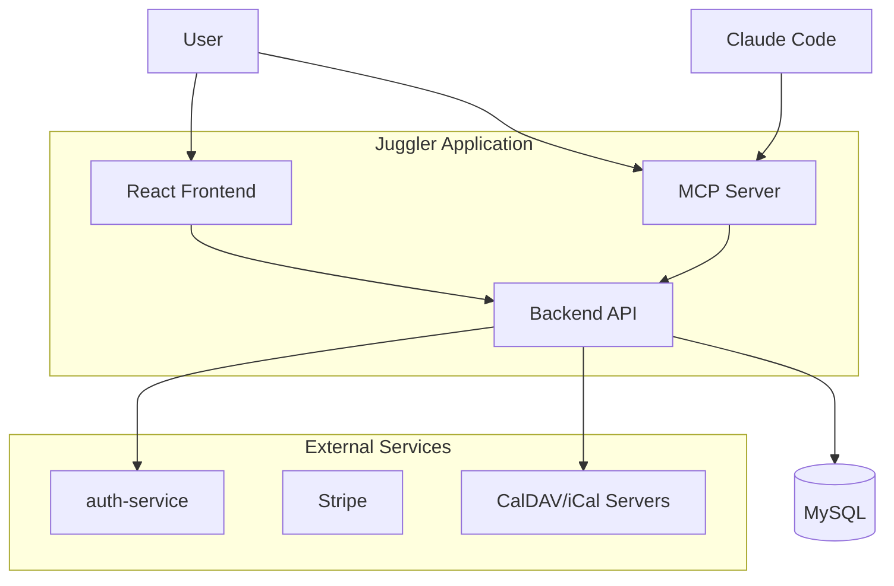
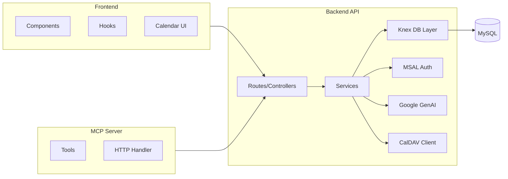
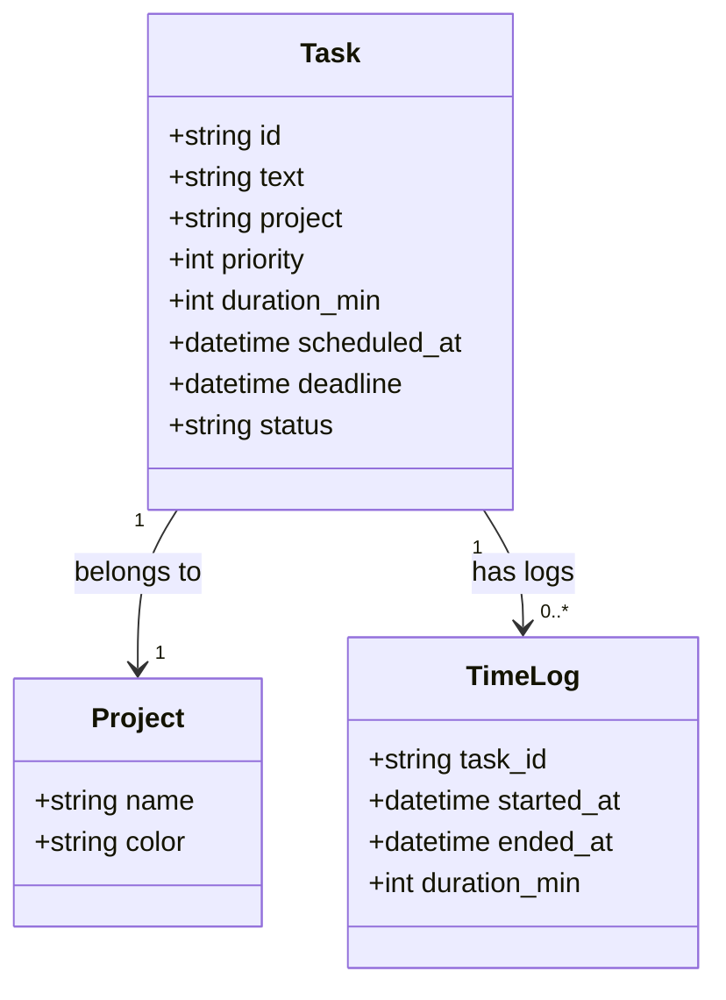

# Juggler — Architecture Overview

**Last Updated:** 2026-05-18  
**Level:** C4 System Context + Container

---

## System Context (C4 Level 1)

---

## Container Diagram (C4 Level 2)

---

## Key Components

| Component | Responsibility |
|-----------|---------------|
| **Routes/Controllers** | HTTP endpoints, request validation (Zod), rate limiting |
| **Services** | Business logic: task CRUD, scheduling, time tracking |
| **Knex DB Layer** | Query builder, migrations, seed data |
| **MSAL Auth** | Microsoft Entra ID integration (optional SSO) |
| **Google GenAI** | Task description suggestions, time estimates |
| **CalDAV Client** | Calendar sync, iCal import/export |
| **MCP Tools** | `list_tasks`, `create_task`, `update_schedule`, etc. |

---

## Data Model (Simplified)

---

## Related Documentation

- [[juggler-api-reference]] — API endpoints
- [[juggler-mcp-doc]] — MCP server tools
