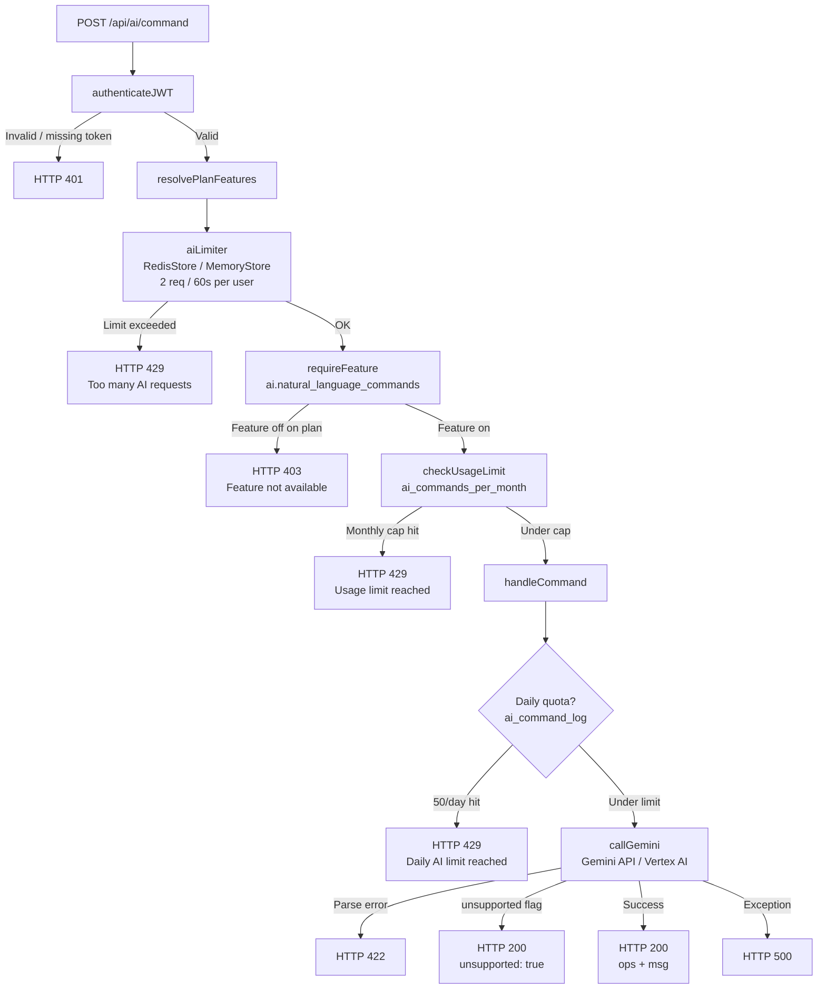

# AI Commands — Design Doc

Natural-language task management for Juggler, powered by Gemini.

---

## 1. Feature Overview

**Purpose:** `POST /api/ai/command` accepts a free-text command from the user and returns a structured JSON ops array that the frontend applies to the task list and schedule. The user never sees raw JSON — the frontend (`AiCommandPanel`) dispatches ops via `onApplyOps` automatically.

**UI entry point:** `AiCommandPanel` (`juggler-frontend/src/components/features/AiCommandPanel.jsx`) — an inline input rendered in the header bar. A portal-rendered dropdown chat log shows the conversation history. The panel also intercepts a small set of location shortcut patterns locally (e.g., `wfh`, `office`, `I'm at the gym`) before ever hitting the API.

**Scope restriction:** The system prompt prepends a highest-priority `SCOPE RESTRICTION` rule before all other instructions. The model is permitted to emit only ops from the supported set below. It must reject general questions, code assistance, math, web lookups, and any request unrelated to managing the user's Juggler tasks and schedule. Off-scope requests receive an `unsupported: true` response — they are never silently ignored or answered in prose.

---

## 2. Supported Operations

All ops are read directly from the system prompt built in `ai.controller.js`. The model must produce `{"ops":[...],"msg":"summary"}`.

### Task Ops

| Op type | Required fields | Example user command | Example ops output |
|---------|----------------|---------------------|-------------------|
| `status` | `id`, `value` | "Mark email task done" | `{"op":"status","id":"t01","value":"done"}` |
| `edit` | `id`, `fields` | "Move groceries to Friday 3pm" | `{"op":"edit","id":"t05","fields":{"date":"5/23","time":"3:00 PM"}}` |
| `add` | `task` object | "Add a task to buy milk" | `{"op":"add","task":{"id":"ai001","text":"Buy milk","date":"","dur":15,...}}` |
| `delete` | `id` | "Delete the dentist task" | `{"op":"delete","id":"t12"}` |

**`edit` field surface:** `date` (M/D), `time` (H:MM AM/PM), `dur` (minutes), `due` (M/D hard deadline), `startAfter` (M/D), `when` (comma-separated slots: morning/lunch/afternoon/evening/night), `pri` (P1–P4), `recurring` (boolean), `dependsOn` (array of task IDs).

**`add` task shape:** `id` (temp ID like `ai001`), `date`, `day`, `text`, `time`, `project`, `pri`, `where`, `when`, `dayReq`, `section`, `notes`, `dur`, `due`, `startAfter`, `recurring`, `dependsOn`.

**Status values:** `done` | `cancel` | `wip` | `open` | `skip` | `""` (clear).

### Config Ops

| Op type | Required fields | Example user command | Example ops output |
|---------|----------------|---------------------|-------------------|
| `set_weekly` | `day`, `location` | "I'm in the office Mondays" | `{"op":"set_weekly","day":"Mon","location":"work"}` |
| `set_block_loc` | `day`, `blockTag`, `location` | "Set morning block home on Tuesday" | `{"op":"set_block_loc","day":"Tue","blockTag":"morning","location":"home"}` |
| `add_location` | `id`, `name`, `icon` | "Add a gym location" | `{"op":"add_location","id":"gym","name":"Gym","icon":"🏋️"}` |
| `add_tool` | `id`, `name`, `icon` | "Add a tablet tool" | `{"op":"add_tool","id":"tablet","name":"Tablet","icon":"📱"}` |
| `set_tool_matrix` | `location`, `tools` | "At home I use my phone and PC" | `{"op":"set_tool_matrix","location":"home","tools":["phone","personal_pc"]}` |
| `set_blocks` | `day`, `blocks` | "Rebuild Monday blocks" | `{"op":"set_blocks","day":"Mon","blocks":[...]}` |
| `clone_blocks` | `from`, `to` | "Copy Monday blocks to weekdays" | `{"op":"clone_blocks","from":"Mon","to":["Tue","Wed","Thu","Fri"]}` |

### Project / Multi-task Creation

When the user asks for a project breakdown, the model emits multiple `add` ops with matching `project` names and wires `dependsOn` chains using the temp IDs (`ai001`, `ai002`, …). Leaf tasks have no deps; downstream tasks reference upstream IDs. Dates and times may be left empty to let the scheduler place them.

---

## 3. Request / Response Contract

### Request

```
POST /api/ai/command
Authorization: Bearer <jwt>
Content-Type: application/json

{
  "command": "string — user's natural-language input",
  "tasks": [ ...open task objects... ],
  "statuses": { "<task-id>": "done|cancel|skip|wip|open", ... },
  "config": {
    "locations": [...],
    "tools": [...],
    "toolMatrix": {...},
    "timeBlocks": {...},
    "locSchedules": {...},
    "locScheduleDefaults": {...},
    "locScheduleOverrides": {...}
  }
}
```

The frontend filters `tasks` to exclude `done`/`cancel`/`skip` statuses before sending, unless the task ID is explicitly mentioned in the command.

### Responses

**Success (ops applied):**
```json
{ "ops": [...], "msg": "Short summary of what was done." }
```

**Out-of-scope request:**
```json
{ "ops": [], "msg": "I can only help with Juggler tasks and scheduling. Try: 'add a task to buy milk', 'mark email task done', or 'reschedule my afternoon tasks'.", "unsupported": true }
```

**Validation error (empty command):**
```
HTTP 400  { "error": "No command provided" }
```

**AI response parse failure:**
```
HTTP 422  { "error": "Bad JSON from AI", "raw": "<first 500 chars, HTML-escaped>" }
```

**Rate limited (per-minute):**
```
HTTP 429  { "error": "Too many AI requests. Max 2 per minute — try again shortly." }
```

**Daily quota exceeded:**
```
HTTP 429  { "error": "Daily AI limit reached (50/day). Try again tomorrow." }
```

**Monthly plan quota exceeded:**
```
HTTP 429  { "error": "Usage limit reached", "code": "USAGE_LIMIT_REACHED", "limit_key": "ai_commands_per_month", "current_usage": N, "limit": N, "current_plan": "...", "upgrade_required": true, "resets_at": "<ISO date>" }
```

**Feature not enabled on plan:**
```
HTTP 403  { "error": "Feature not available on your plan", "code": "FEATURE_NOT_AVAILABLE", "feature": "ai.natural_language_commands", "current_plan": "...", "upgrade_required": true }
```

**Unauthenticated:**
```
HTTP 401
```

**AI backend error:**
```
HTTP 500  { "error": "<message>" }
```

---

## 4. Rate Limiting and Bot Protection

Three independent throttles stack in order:

### 4a. Per-minute rate limit (express-rate-limit)

| Property | Value |
|----------|-------|
| Window | 60 seconds |
| Max requests | 2 |
| Key | `req.user.id` (per authenticated user) |
| Store | RedisStore when `REDIS_URL` set; MemoryStore fallback |
| Key prefix | `jugrl-ai:` |
| 429 message | `"Too many AI requests. Max 2 per minute — try again shortly."` |

**Why per-user keying, not per-IP:** Multiple users on a shared network (office, university, NAT) share a single IP. Per-IP keying would cause one user's burst to exhaust the quota of everyone behind that IP — collateral damage. Per-user keying isolates each account.

**Why Redis matters in production:** Each Cloud Run instance maintains its own in-process MemoryStore. Without Redis, N instances each allow 2 req/min, so an attacker (or runaway client) across N instances effectively gets N×2 req/min. RedisStore shares a single counter across all instances, preserving the 2/min contract regardless of instance count.

**Redis startup race (WR-03 fix):** `maybeRedisStore` defers `RedisStore` construction until the ioredis client reaches `ready` state. `RedisStore` v4 runs `SCRIPT LOAD` at construction — doing this at module load (when `client.status === 'connecting'`) races the TCP handshake and causes `"unexpected reply"` errors. The lazy wrapper falls back to an ephemeral in-memory response during the startup window, then delegates to the real store once ready.

### 4b. Per-user daily quota (ai_command_log table)

Checked inside the controller, after the per-minute limiter. Counts rows in `ai_command_log` for the user over the past 24 hours. Limit: **50 requests/day**. A log row is inserted before the Gemini call — the attempt is counted regardless of whether the model call succeeds.

### 4c. Monthly plan quota (feature-gate middleware)

`checkUsageLimit('ai_commands_per_month')` reads the plan limit from `req.planFeatures.limits.ai_commands_per_month`, atomically increments `plan_usage` via `INSERT … ON DUPLICATE KEY UPDATE`, and returns 429 if the count exceeds the plan cap. Unlimited plans (`limit === -1`) still count for analytics.

### Request Pipeline



---

## 5. Feature Flags

| Flag | Type | Effect |
|------|------|--------|
| `ai.natural_language_commands` | Boolean | Gates the feature entirely. `false` → HTTP 403 before the handler runs. |
| `ai_commands_per_month` | Integer (or `-1` for unlimited) | Per-plan monthly cap. Checked by `checkUsageLimit`. `-1` disables the cap; usage still logged for analytics. |

Both flags are resolved from the JWT's `plans` claim by `resolvePlanFeatures` middleware and are keyed by product slug (`'juggler'`).

---

## 6. AI Backend

Two backends are supported, selected by environment variable:

| Env var | Value | Backend | Auth |
|---------|-------|---------|------|
| `USE_VERTEX_AI` | `true` | GCP Vertex AI | GCP service account (ADC) |
| `USE_VERTEX_AI` | unset / `false` | Gemini API | `GEMINI_API_KEY` |

Both use `@google/genai` (`GoogleGenAI`). Model is `GEMINI_MODEL` (default: `gemini-2.5-flash`). Generation config: `temperature: 0.2`, `topP: 0.8`, `topK: 40`, `maxOutputTokens: 8192`.

All calls go through `trackedGeminiCall` with use case label `AI_USE_CASES.TASK_AI` for AI usage tracking in the payment-service dashboard.

**User input sanitisation:** Before sending to Gemini, the command string has curly quotes, em-dashes, en-dashes, and ellipsis characters normalised to their ASCII equivalents to prevent prompt encoding issues.

---

## 7. Error Reference

| Status | Condition | Response body key |
|--------|-----------|-------------------|
| 400 | Empty or missing `command` field | `error: "No command provided"` |
| 401 | Missing or invalid JWT | (from `authenticateJWT`) |
| 403 | `ai.natural_language_commands` flag off for plan | `code: "FEATURE_NOT_AVAILABLE"` |
| 422 | Gemini returned non-JSON that could not be extracted | `error: "Bad JSON from AI"`, `raw: "..."` |
| 429 | Per-minute rate limit (2/min) | `error: "Too many AI requests. Max 2 per minute — try again shortly."` |
| 429 | Per-day quota (50/day) | `error: "Daily AI limit reached (50/day). Try again tomorrow."` |
| 429 | Monthly plan quota exceeded | `code: "USAGE_LIMIT_REACHED"`, `resets_at: "<ISO>"` |
| 500 | Gemini client error or unhandled exception | `error: "<message>"` |

---

## 8. Security Notes

**Scope restriction as prompt injection defence:** The `SCOPE RESTRICTION` block appears at the very start of the system prompt, before all other instructions, making it the highest-priority rule the model sees. This limits the blast radius of prompt injection attempts: even if a malicious task description contains instructions to "ignore previous rules", the model must still respond with the out-of-scope JSON object rather than following injected instructions. The restriction does not eliminate prompt injection risk but significantly constrains what an attacker can achieve.

**Per-user rate limiting:** Because the key is `req.user.id`, one user's request burst cannot exhaust another user's per-minute allowance. Shared-IP scenarios (offices, universities, mobile carriers) do not cause collateral damage.

**JWT required before rate limiting:** `authenticateJWT` runs before `aiLimiter`. Unauthenticated requests never reach the rate limiter or the AI handler. The fallback key `'anon'` in `keyGenerator` is a dead code path under normal middleware ordering.

**Redis required for multi-instance production:** Deploying to Cloud Run without `REDIS_URL` set means each instance tracks its own counter independently. The effective rate limit becomes 2 × (instance count) per minute. Redis is a deployment requirement for the 2/min contract to hold.

**Daily quota is pre-debited:** `ai_command_log` is written before the Gemini call. This prevents quota manipulation via rapid parallel requests that each pass the count check before any log row is committed.
