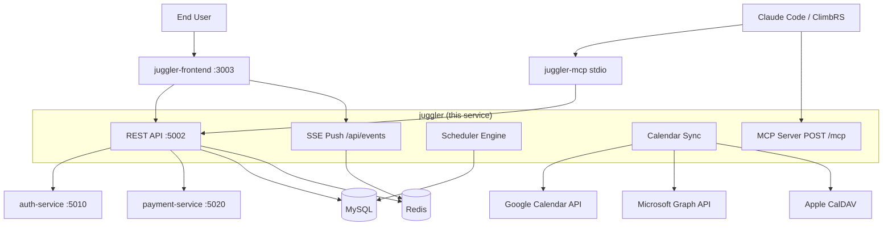
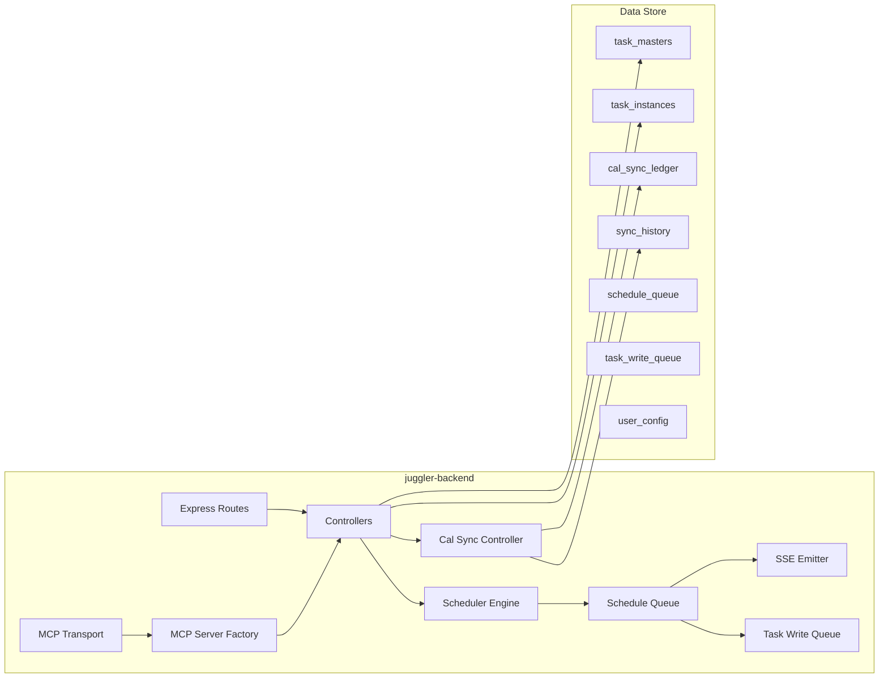

# Juggler — Architecture Overview

**Last Updated:** 2026-05-31

---

## System Context (C4 Level 1)

---

## Container Diagram (C4 Level 2)

---

## Key Subsystems

### Scheduler

The scheduler is the core differentiator. It places tasks into time slots using a most-constrained-first algorithm.

**Entry point:** `src/scheduler/unifiedScheduleV2.js`
**Runner:** `src/scheduler/runSchedule.js`
**Queue:** `src/scheduler/scheduleQueue.js` — debounce-based trigger; runs scheduler 2s after the last mutation

**Scheduling order (must never be reversed):**

1. Fixed/calendar-synced tasks (immovable anchors)
2. Tasks with hard deadlines
3. Tasks with dependency chains
4. Recurring tasks with time-window preferences
5. Flexible tasks (placement by time-of-day preference, location, weather)

**Placement modes** (stored on `task_masters.placement_mode`):

| Mode | Description |
|------|-------------|
| `fixed` | Locked to a specific date and time |
| `all_day` | Date-locked, time is free |
| `time_window` | Placed within user's declared time-of-day windows |
| `time_blocks` | Placed within named time blocks from user config |
| `anytime` | No time preference — scheduler fills remaining capacity |
| `marker` | Non-blocking reminder; does not consume capacity |

**Recurring tasks:** Instances are reconciled in `src/scheduler/reconcileOccurrences.js`. Each instance must be placed on the same day its recurrence rule fires — never on a different day.

**Split tasks:** A task with `split=true` and a `dur` larger than available contiguous blocks is split into chunks. Each chunk becomes a separate `task_instance` row with `split_ordinal` + `split_total`.

---

### Calendar Sync

**Controller:** `src/controllers/cal-sync.controller.js`

Sync is a four-phase operation:

1. **Gather** — fetch remote events from each connected provider
2. **Diff** — compare against `cal_sync_ledger` to compute what changed
3. **Push** — write local task changes back to the provider calendar
4. **Write** — commit all task, ledger, and history changes in one transaction

Per-user sync lock (`sync_locks` table) prevents concurrent sync runs from corrupting ledger state.

**Providers:**

| Provider | Adapter | Auth storage |
|----------|---------|-------------|
| Google Calendar | `src/lib/cal-adapters/gcal.adapter.js` | `users.gcal_refresh_token` |
| Microsoft | `src/lib/cal-adapters/msft.adapter.js` | `users.msft_cal_refresh_token` |
| Apple CalDAV | `src/lib/cal-adapters/apple.adapter.js` | `user_calendars` table (multi-cal aware) |

---

### MCP Server (Embedded)

**Endpoint:** `POST /mcp` (Streamable HTTP, stateless)
**Factory:** `src/mcp/server.js` — creates a per-request `McpServer` scoped to the authenticated user
**Transport:** `src/mcp/transport.js` — authenticates via Bearer JWT, delegates to `auth-client/mcp-auth`
**Tools:** registered by `src/mcp/tools/tasks.js`, `schedule.js`, `config.js`, `data.js`

Each MCP request creates a fresh server instance. No session state is maintained across requests — this works correctly across Cloud Run instances.

---

### Task Write Queue

When the per-user sync lock is held, incoming task mutations are split:

- **Non-scheduling fields** (`text`, `notes`, `project`, `url`, etc.) — written immediately; safe under lock
- **Scheduling fields** (timing, placement mode, recurrence, etc.) — queued in `task_write_queue`, flushed when the lock releases

This prevents mutations from blocking or being lost during long-running sync or schedule operations.

---

### SSE Push

**Emitter:** `src/lib/sse-emitter.js`
**Endpoint:** `GET /api/events` (accepts JWT via `?token=` query param for EventSource compatibility)

When the scheduler completes, it emits a `schedule:changed` event to all connected frontends for that user. With Redis configured, fan-out works across multiple Cloud Run instances. Without Redis, fan-out is local-instance only.

---

## Data Model Summary

| Table | Purpose |
|-------|---------|
| `task_masters` | One row per logical task — user intent, constraints, recurrence rules |
| `task_instances` | Scheduler-placed occurrences — one per placement (N for recurring/split) |
| `tasks_v` | View joining masters and instances — all read paths go here |
| `cal_sync_ledger` | Current bi-directional sync state per (task, provider event) |
| `sync_history` | Append-only audit log of every sync action |
| `user_calendars` | Enabled calendars per user per provider (multi-cal; Apple only today) |
| `schedule_queue` | Debounce trigger rows for scheduler runs |
| `task_write_queue` | Durable coalescing buffer for writes arriving under sync lock |
| `user_config` | JSON config blobs: time blocks, preferences, locations, tool matrix |
| `projects` | User-defined project groups |
| `locations` | Named locations with optional lat/lon for weather scheduling |
| `tools` | Named tools/equipment for tool-matrix scheduling |
| `weather_cache` | Open-Meteo forecast cache (1h TTL, 10km grid) |
| `ai_command_log` | Per-user daily AI command quota (50/day) |
| `feature_events` | Feature-gate analytics log |
| `sync_locks` | Per-user distributed lock for sync and schedule runs |

Full schema detail: `docs/architecture/SCHEMA.md`

---

## Related Documentation

- `docs/architecture/SCHEDULER.md` — full scheduler design doc
- `docs/architecture/SCHEMA.md` — database schema reference
- `docs/architecture/TASK-PROPERTIES.md` — all task fields
- `docs/architecture/TASK-STATE-MATRIX.md` — valid task state transitions
- `docs/architecture/CALENDAR-SYNC-REFACTOR.md` — calendar sync design
- `docs/mcp/juggler-mcp-server.md` — MCP server reference
- `docs/api/README.md` — REST API reference
