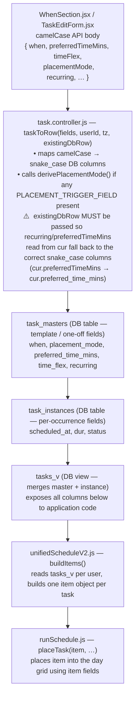

# Scheduler UI → State Map

**Last Updated:** 2026-05-25

Maps every UI control in the task editor (WhenSection) to the fields written to the DB
and the resulting scheduler behavior. Verified against `WhenSection.jsx`, `TaskEditForm.jsx`,
`task.controller.js`, and `unifiedScheduleV2.js`.

---

## Full pipeline: UI → scheduler



**Internal MCP path** (`src/mcp/tools/tasks.js` `update_task`):
Same `taskToRow` call, but `existing` is fetched first from `tasks_with_sync_v` and
**must be passed as 4th arg** — see fix in commit `40e7329`.

---

## What the scheduler receives per task

`buildItems()` in `unifiedScheduleV2.js` reads `tasks_v` rows (camelCase via `rowToTask`)
and produces one item object per task. This is the complete set of fields the scheduler sees:

### tasks_v columns consumed by buildItems

| `tasks_v` column (snake_case) | camelCase in code | Used for |
|-------------------------------|-------------------|----------|
| `placement_mode` | `placementMode` | driving all scheduler logic; sole immovability signal |
| `dur` | `dur` | slot duration; `effectiveDuration()` applies split/time-remaining |
| `when` | `when` | block-tag windows (FLEXIBLE / RECURRING_FLEXIBLE) |
| `flex_when` | `flexWhen` | fallback to any slot when named blocks are full |
| `scheduled_at` (→ `date`/`time`) | `date`, `time` | `anchorDate`, `anchorMin` |
| `preferred_time_mins` | `preferredTimeMins` | `anchorMin`, `windowLo/Hi` (RECURRING_WINDOW/RIGID) |
| `time_flex` | `timeFlex` | `windowLo = preferredTimeMins − timeFlex`, `windowHi = +timeFlex` |
| `deadline` | `deadline` | `deadlineDate` |
| `start_after_at` | `startAfter` | `startAfterDate` |
| `depends_on` | `dependsOn` | `dependsOn[]` — deps-met gate |
| `travel_before` / `travel_after` | `travelBefore`, `travelAfter` | buffers around slot (first/last chunk only) |
| `split_ordinal` / `split_total` | `splitOrdinal`, `splitTotal` | which chunk; controls travel buffer assignment |
| `recur` | `recur` | `cycleDays`, `isFlexibleTpc` |
| `pri` | `pri` | `priRank` — most-constrained ordering |
| `generated` | `generated` | `isGenerated` — day-locks generated one-off instances |
| `recurring` | `recurring` | `isRecurring`, `isDayLocked` |
| `day_req` | `dayReq` | `allowedDows[]` (Sun=0…Sat=6) |
| `source_id` / `master_id` | `sourceId` | `masterId` — links split chunks and instances to template |
| `marker` | `marker` | `isMarker` — display-only, dur=0, never placed in grid |
| `task_type` | `taskType` | filters out `recurring_template` rows entirely |
| `status` | `status` | skips done/cancel/skip/pause/disabled tasks |

### Item object produced by buildItems

Every schedulable task becomes one item object. Fields used downstream by `placeTask`:

```js
{
  task,               // full tasks_v row (for annotations/reporting)
  id,
  dur,                // effectiveDuration(t) — 0 for markers, chunk dur for splits
  pri,                // normalized P1-P4
  priRank,            // 10/20/50/80 — used for most-constrained sort

  // Block-window placement (FLEXIBLE / RECURRING_FLEXIBLE)
  when,               // stripped of 'fixed'; empty string = anytime
  whenParts,          // parseWhen(when) — array of block-tag strings
  flexWhen,           // true → retry with anytime if named blocks full

  // Fixed
  isFixedWhen,        // placement_mode === FIXED — sole immovability signal; anchors exact time
  isGenerated,        // !!generated && !recurring — day-locks non-recurring generated tasks

  // Recurring
  isRecurring,        // placement_mode in [RIGID, WINDOW, FLEXIBLE]
  isRigid,            // placement_mode === RECURRING_RIGID
  isMarker,           // placement_mode === MARKER
  isDayLocked,        // recurring && (RIGID || !isFlexibleTpc)
  isFlexibleTpc,      // timesPerCycle < selectedDays → instance may roam within cycle

  // Anchor (where to place / start searching)
  anchorDate,         // toKey(task.date) — ISO YYYY-MM-DD
  anchorMin,          // parseTimeToMinutes(task.time) OR preferredTimeMins
                      // (null for FLEXIBLE tasks with no scheduled time)

  // Time-window mode (RECURRING_WINDOW)
  isWindowMode,       // true when placement_mode === RECURRING_WINDOW AND window is valid
  windowLo,           // max(DAY_START, preferredTimeMins − timeFlex)
  windowHi,           // min(DAY_END,   preferredTimeMins + timeFlex)
  isMissedWindow,     // windowHi ≤ nowMins on today → placed in unplaced (reason='missed')

  // Preferred-time miss detection (RECURRING_FLEXIBLE with preferredTimeMins)
  isMissedPreferredTime, // nowMins ≥ preferredTimeMins + timeFlex → unplaced (reason='missed')
  preferredTimeMins,  // direct copy of task.preferredTimeMins (null if not set)

  // Deadline / start constraint
  deadlineDate,       // user deadline; recurring instances default to anchorDate
  startAfterDate,     // task not placeable before this date

  // Dependencies
  dependsOn,          // string[] of task IDs this item must follow
  depNames,           // human-readable names for placement reason annotations

  // Travel buffers
  travelBefore,       // minutes before slot; 0 on non-first split chunks
  travelAfter,        // minutes after slot; 0 on non-last split chunks

  // Day-of-week eligibility
  allowedDows,        // null = any day; Set of [0-6] = specific days (Sun=0)

  // Cycle / split
  cycleDays,          // recurrence cycle length in days
  splitOrdinal,       // which chunk (1-based)
  splitTotal,         // total chunks
  masterId,           // sourceId || master_id (links chunk to template)

  // Computed later
  slack,              // capacity − dur; filled after all items built
  preferLatestSlot,   // RECURRING_FLEXIBLE past-anchorMin today → push to latest slot
  isAllDay            // when includes 'allday' → item is filtered out before placement
}
```

---

## `placement_mode` derivation

`derivePlacementMode()` runs on every write that touches a placement-trigger field
(`marker`, `when`, `recurring`, `preferredTimeMins`, `placementMode`).
First match wins:

```
marker = true                                     → MARKER
placementMode = 'fixed'                           → FIXED
recurring AND preferredTimeMins != null           → RECURRING_WINDOW
recurring                                         → RECURRING_FLEXIBLE
(default)                                         → FLEXIBLE
```

> `rigid` and `when includes 'fixed'` were removed in the When-mode simplification.
> `fixed` is now set explicitly by the client via `placementMode: 'fixed'`.

⚠️ The derive only re-runs when a trigger field is **written in that save**. A task whose
`preferred_time_mins` was set via a direct DB write (or an older API path) may retain a
stale `placement_mode` that does not match the current field values. See the "stale
placement_mode" section at the bottom.

---

## Single immovability axis

`placement_mode === 'fixed'` is the sole immovability signal. The previous dual-axis model (`rigid` + `date_pinned`) has been removed.

| Signal | Column | What it means | Who sets it |
|--------|--------|--------------|-------------|
| `placement_mode = 'fixed'` | `placement_mode` | Task is anchored to its exact `date` + `time`. Scheduler will not move it. | User (mode picker) or calendar sync |

Calendar-synced tasks receive `placement_mode = 'fixed'` from the sync adapters. The `isFixed` derived value in the frontend (`placementMode === 'fixed' && isCalManaged`) grays out the scheduling-mode controls only for calendar-managed tasks — Juggler-native fixed tasks display normally.

The removed columns (`date_pinned` on `task_instances`, `rigid` and `prev_when` on `task_masters`) are dropped by migration `20260526000000_drop_pinned_and_rigid_columns.js` (pending execution after audit SQL confirms zero mismatched rows).

---

## `placement_mode` → scheduler behavior

| placement_mode       | Slot driver                        | Day-locked | If window/time passed today |
|----------------------|------------------------------------|------------|----------------------------|
| `FLEXIBLE`           | `whenParts` block tags             | floats across horizon      | reschedule forward |
| `FIXED`              | `anchorMin` (exact, immovable)     | yes        | stays at anchored time     |
| `MARKER`             | none — display only, dur=0         | yes        | n/a                        |
| `RECURRING_FLEXIBLE` | `whenParts` block tags             | yes        | placed at latest slot      |
| `RECURRING_WINDOW`   | `windowLo`…`windowHi`             | yes        | unplaced (reason='missed') |
| `RECURRING_RIGID`    | `anchorMin` (exact)                | yes        | unplaced (reason='missed') |

### `when` field role by mode

| placement_mode       | `when` role                                        |
|----------------------|----------------------------------------------------|
| `FLEXIBLE`           | **authoritative** — drives block-window list       |
| `RECURRING_FLEXIBLE` | **authoritative** — drives block-window list       |
| `RECURRING_WINDOW`   | **vestigial** — written by UI, ignored by scheduler|
| `RECURRING_RIGID`    | **vestigial** — written by UI, ignored by scheduler|
| `FIXED`              | **not used** — `placement_mode='fixed'` is set directly by the client; `when` is not read by the scheduler in this mode |
| `MARKER`             | carries `'allday'` or similar; allday items are filtered before placement |

---

## Non-recurring task UI controls

Rendered when `!isRecurring && !marker`. All controls grayed out when `isFixed`
(`placementMode === 'fixed' && isCalManaged` — calendar-managed tasks only).

The old Float/Fixed toggle and Pin/Pinned toggle have been removed. `fixed` is now the
fifth option in the scheduling mode picker, available to all tasks.

**Non-recurring When section** — Scheduling mode picker (grayed out when `isFixed`, calendar-managed tasks only)

- **Anytime**
  - Writes: `placementMode='anytime'`, `when=''`
  - Derives: `placementMode = FLEXIBLE`
  - Scheduler: any free slot

- **Time Window**
  - Writes: `placementMode='time_window'`, `preferredTimeMins`, `timeFlex`
  - Derives: `placementMode = RECURRING_WINDOW` (recurring) or `FLEXIBLE` (one-off)

- **Time Blocks**
  - Writes: `placementMode='time_blocks'`, `when=selected block tags`
  - Derives: `placementMode = RECURRING_FLEXIBLE` (recurring) or `FLEXIBLE` (one-off)

- **All Day**
  - Writes: `placementMode='all_day'`, `split=false`, `travel=0`
  - Derives: `placementMode = ALL_DAY`
  - Scheduler: `item.isAllDay=true` — filtered out before placement; task appears as full-day banner in calendar UI only

- **Fixed** (5th option)
  - Writes: `placementMode='fixed'`, `date`, `time` (both required)
  - Derives: `placementMode = FIXED`
  - Scheduler: anchored at exact time; blocks the slot
  - Client validation: `date` + `time` must be set before save (400 if absent)
  - Recurring + Fixed: not supported — `WhenSection` shows "not available" message with the four valid mode buttons as the exit path

**Day requirement** (non-recurring, only when `!isFixed`):

| UI | `dayReq` value | `allowedDows` in item | Scheduler effect |
|----|---------------|----------------------|-----------------|
| Any   | `'any'`     | null                 | any day          |
| Wkday | `'weekday'` | {1,2,3,4,5}          | Mon–Fri only     |
| Wkend | `'weekend'` | {0,6}                | Sat–Sun only     |
| Su/Mo/… | `'Su,M,…'` | specific set        | specific days   |

---

## Recurring task UI controls

Rendered when `recurring && !marker`. Three-way mutually exclusive mode picker.
Clicking any mode clears the other mode's fields via `buildFields`.

**Recurring task scheduling modes** — three-way mutually exclusive mode picker; clicking any mode clears the other mode's fields via `buildFields`

- **Anytime**
  - Writes: `preferredTimeMins=null`, `timeFlex=null`, `when=''`
  - Derives: `placementMode = RECURRING_FLEXIBLE`
  - Scheduler item: `isWindowMode=false`, `anchorMin=null`, `whenParts=[]`
    - searches all time blocks on `anchorDate`
    - day-locked to `anchorDate`
    - if scheduled time already past today: placed at latest available slot

- **Time Window**
  - User inputs: Time (HH:MM), +/- Window select
  - Writes: `preferredTimeMins = HH*60+MM`, `timeFlex = N` (from +/- Window select), `when = single_tag` (vestigial — ignored by scheduler in this mode)
  - Note: `when` IS written but IS IGNORED by the scheduler in `RECURRING_WINDOW` and `RECURRING_RIGID` modes. Slot selection uses ONLY `preferredTimeMins` and `timeFlex`. The stored tag (`'morning'` by default) is vestigial.
  - +/- Window select controls `placementMode`:
    - **exact** (`timeFlex=0`)
      - Derives: `placementMode = RECURRING_RIGID`
      - Scheduler item: `isRigid=true`, `anchorMin=preferredTimeMins`, `isWindowMode=false`
        - placed at exact `preferredTimeMins` minute
        - day-locked to `anchorDate`
        - if `preferredTimeMins` already past today: unplaced (`reason='missed'`)
    - **+/-15m / +/-30m / +/-1hr / +/-1.5hr / +/-2hr** (`timeFlex=N`)
      - Derives: `placementMode = RECURRING_WINDOW`
      - Scheduler item: `isWindowMode=true`, `windowLo/Hi` set, `anchorMin=preferredTimeMins`
        - `windowLo = max(DAY_START, preferredTimeMins - timeFlex)`
        - `windowHi = min(DAY_END, preferredTimeMins + timeFlex)`
        - earliest free slot in `[windowLo, windowHi]`
        - day-locked to `anchorDate`
        - if `windowHi <= nowMins` (today): `isMissedWindow=true`, unplaced (`reason='missed'`)
        - if window inverted (outside schedulable day): `isWindowMode` falls back to when-tag

- **Time Blocks**
  - Writes: `preferredTimeMins=null`, `timeFlex=null`, `when = selected block tags` (e.g. `'morning,lunch,afternoon,evening,night'`)
  - Derives: `placementMode = RECURRING_FLEXIBLE`
  - Scheduler item: `isWindowMode=false`, `anchorMin=null`, `whenParts=[...tags]`
    - slot must fall within one of the selected named blocks
    - day-locked to `anchorDate`
    - if scheduled time already past today: placed at latest available slot

---

## Known data hazard: stale `placement_mode`

`placement_mode` is re-derived only when a PLACEMENT_TRIGGER_FIELD is present in the
save payload. A task whose `preferred_time_mins` was written via a direct DB write (or
a legacy API path) may retain a stale `placement_mode` that does not reflect its
current fields.

**Symptom:** `recurring=true`, `preferred_time_mins=1140`, `when='evening'`,
`placement_mode='flexible'` → scheduler builds item with `isWindowMode=false` and
uses block-window logic instead of the 7 PM window.

**Root cause (fixed 2026-05-18, commit 40e7329):**
`mcp/tools/tasks.js` `update_task` was calling `taskToRow(fields, userId, tz)` without
passing the fetched `existing` row as `currentTask`. With `cur={}`, `cur.recurring` is
`undefined`, so `derivePlacementMode` always fell through to `FLEXIBLE`. Every internal
MCP update that touched a placement-trigger field silently clobbered `placement_mode`.

**Detection:**
```sql
SELECT id, text, `when`, preferred_time_mins, placement_mode
FROM tasks_v
WHERE recurring = 1
  AND preferred_time_mins IS NOT NULL
  AND placement_mode IN ('flexible', 'recurring_flexible');
```

**Fix (DB patch):**
```sql
UPDATE task_masters
SET placement_mode = 'recurring_window', updated_at = NOW()
WHERE recurring = 1
  AND preferred_time_mins IS NOT NULL
  AND placement_mode IN ('flexible', 'recurring_flexible');
```

Alternatively: re-save the task from the UI — any field change re-triggers derivePlacementMode.

**Guard:** if adding any new code path that calls `taskToRow` for an update,
always pass the pre-fetched existing row as the 4th argument.
